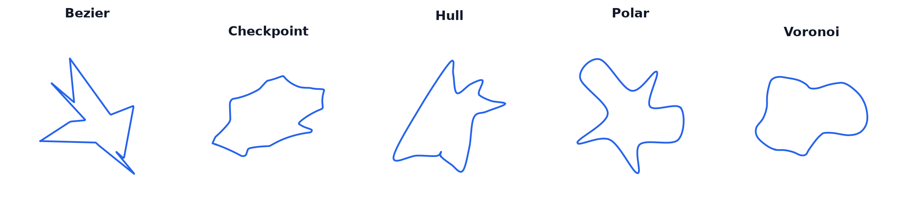
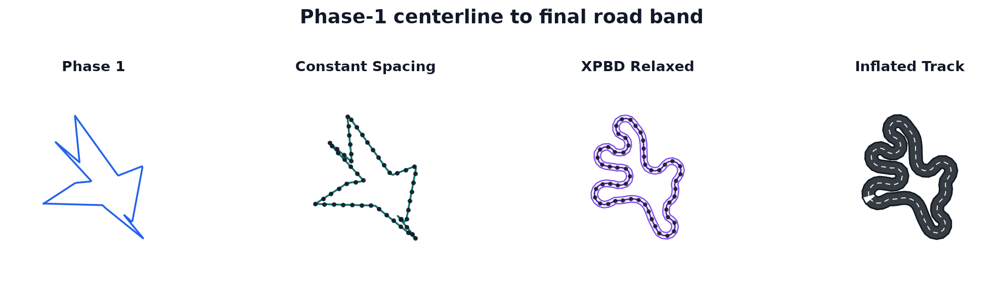

# track_gen

GPU-batched generation of closed-loop race tracks. Given a batch of per-environment
seeds, `track_gen` produces, in parallel, `E` smooth closed centerlines plus their
constant-width outer/inner borders and per-point frames — ready to drop into a batched
RL simulator.

The whole pipeline — **generation → resample → relaxation → inflation** — is expressed
as [NVIDIA Warp](https://github.com/NVIDIA/warp) kernels. It runs on the Warp **`cpu`**
device (GPU-free, for tests/CI) and on **`cuda`** (production). Runtime outputs are Warp
arrays; tests and diagnostics may view them through `wp.to_torch`. The CUDA path captures
the full pipeline as a single replayable **CUDA graph** on the first `generate()` call.

```
seeds[E] ─► registered phase-1 generator ─► constant-spacing resample ─► XPBD relax ─► inflate ─► Track
            bezier/checkpoint/hull/polar/voronoi                         thickness≥w              outer/center/inner
```



*One representative raw phase-1 centerline from each standard generator, rendered with
fixed seeds and default parameters.*



*The runtime pipeline turns the first default-parameter Bezier sample in the strip above
from a raw phase-1 centerline into a constant-spacing path, relaxes it with XPBD, then
inflates it into a constant-width road band.*

## Install

Python ≥ 3.10. This is a Warp-first library: `warp-lang` and `numpy` are the only
required runtime dependencies. `torch`, `scipy`, `matplotlib`, and `pytest` live in the
`dev` extra for tests, benchmarks, and oracle comparisons; `gradio` lives in the `ui`
extra. The runtime path runs on the Warp `cpu` device (GPU-free, for tests/CI) and on
`cuda`.

### From scratch with [uv](https://docs.astral.sh/uv/) (recommended)

```bash
# 1. install uv (skip if you already have it)
curl -LsSf https://astral.sh/uv/install.sh | sh

# 2. create the project venv — uv fetches Python 3.12 if it isn't present
uv venv --python 3.12

# 3. install track_gen (editable) with the dev extras (warp-lang comes in as a core dep)
uv pip install -e ".[dev]"

# 4. verify the fast lane
.venv/bin/python -m pytest -q -m "not slow and not benchmark and not cuda"
```

### With venv + pip

```bash
python -m venv .venv
.venv/bin/pip install -e ".[dev]"
```

Both create a `.venv/`; run anything in it with `.venv/bin/python …` (or `source .venv/bin/activate`,
or `uv run …`). Core deps: `numpy`, `warp-lang`. Extras: `dev` → `pytest`, `matplotlib`, `scipy`, `torch`; `ui` → `gradio`.

## Quickstart

```python
import warp as wp
wp.init()

from track_gen import TrackGenerator, TrackGenConfig, PerEnvSeededRNG

E, device = 64, "cuda"  # or "cpu"
config = TrackGenConfig(num_envs=E, half_width=0.03, device=device)
rng = PerEnvSeededRNG(seeds=0, num_envs=E, device=device)

generator = TrackGenerator(config, rng)
track = generator.generate()  # fixed batch: config.num_envs tracks

center = wp.to_torch(track.center).view(E, config.N_max, 2)
outer = wp.to_torch(track.outer).view(E, config.N_max, 2)
inner = wp.to_torch(track.inner).view(E, config.N_max, 2)
valid = wp.to_torch(track.valid).bool()
count = wp.to_torch(track.count)

center[0, : int(count[0])]  # real arc-uniform centerline points for env 0
```

`TrackGenerator` is fixed-batch. Omit `generate()`'s argument, or pass the integer
`E == config.num_envs`; explicit environment-id sequences are rejected because the CUDA
graph captures one fixed batch shape. The same `Track` instance and Warp buffers are reused
on every call, so use `track.clone()` when you need an independent snapshot.

Registered first-stage generators are selected with `TrackGenConfig(generator=...)`:
`"bezier"` (default), `"checkpoint"`, `"hull"`, `"polar"`, and `"voronoi"`. The Fourier
generator lives in `track_gen._experimental` and is **unsupported** — it is not on the
Warp pipeline and receives no compatibility guarantees.


*Five deterministic raw phase-1 centerline outputs from each standard generator,
rendered by `.venv/bin/python -m viz.render_readme_assets`.*

### Choosing a generator

The first-stage centerline generator is selected by `TrackGenConfig(generator=...)`.
Available generators: see `track_gen._src.generator_registry.available()`. Adding a method
is additive — see `docs/generator-contract.md` and the tradeoff table in
`docs/generator-baseline.md`.

### Output (constant spacing)

There is one output mode, `constant_spacing` — the only value `config.output_mode` accepts
(`__post_init__` raises otherwise). Each track is emitted at a constant arc *spacing* rather
than a constant point *count*: a per-track `count[e] = floor(perimeter/spacing)+1`, capped at
`N_max` and NaN-padded past it. `spacing` defaults to `None` → auto `0.6*half_width` (the
relax-friendly value; set it explicitly to override). The legacy `fixed` mode (constant
`num_points`) was **dropped**: a fixed count over-resolves short tracks, so the Jacobi XPBD
solve under-converges and the road self-overlaps; relaxing at a width-appropriate spacing
converges to smooth, valid tracks on fewer nodes. `num_points` now only sets the intermediate
dense-resample resolution. Size `N_max ≥ max(perimeter)/spacing + 1` so no track is truncated.

### Advanced XPBD separation cache

The relaxation solve has one expensive term: non-neighbour separation. The exact separation
target is:

```text
target = 2 * half_width * (1 + relax_margin)
```

The baseline (`relax_sep_every=1`, `relax_sep_cache_slots=0`) scans all non-neighbour pairs
every XPBD sweep. This is robust, but it is `O(count[e]^2)` per track per sweep. Three
advanced knobs expose a graph-capturable broadphase cache for this term:

| setting | meaning | default |
|---|---|---|
| `relax_sep_every` | Broadphase refresh interval `K`. With no cache, this is a naive skip cadence; with cache enabled, this rebuilds candidates every `K` sweeps. | `1` |
| `relax_sep_cache_slots` | Fixed candidate capacity per bead. `0` disables caching. Larger values use more memory and narrowphase work, but reduce candidate overflow risk. | `0` |
| `relax_sep_cache_skin` | Extra broadphase radius as a fraction of `target`: cache radius is `target * (1 + skin)`. Exact separation is still applied only for current `dist < target`. | `0.5` |

Cached mode is enabled when `relax_sep_cache_slots > 0` and `relax_sep_every > 1`. In that
mode, TrackGen rebuilds a fixed-size per-bead candidate list every `K` sweeps, then runs the
exact narrowphase distance test and separation push against the cached candidates on every
sweep. This is different from the naive cadence path, which simply skips separation on
intermediate sweeps. `skin=0.0` stores only pairs already inside the exact separation target at
refresh time; positive skin stores near pairs too, which is safer for long refresh intervals but
slower.

A useful high-throughput setting from the `E=8192`, `half_width=0.03`,
`relax_iters=150` CUDA graph benchmark was:

```python
TrackGenConfig(
    ...,
    relax_sep_every=40,
    relax_sep_cache_slots=16,
    relax_sep_cache_skin=0.0,
)
```

On the benchmark machine this was about `0.066 s` per graph replay versus `0.366 s` for the
dense baseline, with effectively unchanged validity in the checked runs. Keep the dense
baseline for maximum conservatism; use the cache knobs when throughput matters and validate
yield in the target regime.

### The `Track` result

All boundary arrays are index-aligned (`outer[i]`, `center[i]`, `inner[i]` share one
cross-section normal). Half-width is recovered as `‖outer − center‖`.

| field | shape | meaning |
|---|---|---|
| `outer`, `center`, `inner` | `[E, N, 2]` | border / centerline / border points |
| `tangent`, `normal` | `[E, N, 2]` | unit tangent and left-normal along the centerline |
| `arclen` | `[E, N]` | cumulative arc length (0 at index 0) |
| `length` | `[E]` | closed-loop perimeter |
| `valid` | `[E]` bool | per-track validity |
| `count` | `[E]` int | real points per track (`floor(perimeter/spacing)+1`, capped at `N_max`); the rest of each `[N, 2]` row is NaN padding |

## Runtime facade and CUDA graph capture

`TrackGenerator` is the public runtime facade. It preallocates generator scratch, pipeline
scratch, seed buffers, and a persistent `Track` once in `__init__`. On `cpu`, every
`generate()` call runs eagerly. On `cuda`, the first `generate()` warms kernels, captures
the whole pipeline into a `wp.Graph`, and immediately replays it; later calls copy the
current RNG seeds into the fixed seed buffer and replay the same graph.

The old top-level `generate_tracks_warp` / `generate_tracks_warp_graph` helpers are no
longer public API. Use `TrackGenerator(config, rng).generate()` for both eager CPU and
auto-captured CUDA execution.

## Architecture

See **[docs/ARCHITECTURE.md](docs/ARCHITECTURE.md)** for the full walkthrough: each stage
and its Warp kernels, the kernel conventions, the torch-as-test-oracle approach, and how
the end-to-end CUDA graph is captured.

In short: every stage is a Warp kernel over flat `[E*N]` arrays (one thread per element,
env index `= tid // N`). First-stage generation uses Warp's built-in RNG in one fixed
pass through the selected registered generator; any local fallback is generator-specific,
and final geometric validity is decided after relaxation/inflation.
The torch reference implementation (`tests._oracle.geometry` / `inflation` / `generators` /
`relaxation`) lives under `tests/_oracle/` and is **not** part of the shipped package — it serves purely as the
**verification oracle**: every Warp kernel has a test asserting it matches its torch
counterpart on both `cpu` and `cuda`.

## Project layout

```
track_gen/
  __init__.py        # curated public API (TrackGenerator, TrackGenConfig, Track,
                     #   PerEnvSeededRNG, __version__)
  _version.py
  _src/              # the Warp pipeline (private core)
    warp_pipeline.py warp_relax.py track_generator.py types.py rng_utils.py rng_kernels.py
    warp_generate*.py # registered phase-1 generators: bezier, checkpoint, hull, polar, voronoi
  _experimental/     # unsupported prototypes/reports (Fourier, checkpoint diagnostics)
tests/
  _oracle/           # torch reference impl used to validate the Warp kernels
  test_*.py
benchmarks/  viz/  docs/
```

## Development

```bash
# Fast local lane: skips slower quality gates, benchmark checks, and CUDA-only graph tests.
.venv/bin/python -m pytest -q -m "not slow and not benchmark and not cuda"

# Full suite. CUDA-only assertions are skipped automatically when CUDA is unavailable.
.venv/bin/python -m pytest -q

# Compare every registered first-stage generator on quality/diversity/speed.
.venv/bin/python -m benchmarks.compare_generators --E 512 --seed 0

# End-to-end benchmark (auto device, E=8192). --graph captures + times the CUDA graph.
.venv/bin/python -m benchmarks.benchmark_pipeline --graph
.venv/bin/python -m benchmarks.benchmark_pipeline --E 2048 --cpu

# Render sample tracks without launching the Gradio app.
.venv/bin/python -m viz.plot_tracks --images 1 --rows 4 --cols 4 --cpu

# Rebuild the committed README images from deterministic fixed-seed runs.
.venv/bin/python -m viz.render_readme_assets
```

Pytest markers: `slow` covers quality gates that are useful but heavier than smoke tests,
`benchmark` covers benchmark harness checks, and `cuda` covers tests that require a CUDA
device.

**Conventions** (see `docs/ARCHITECTURE.md`): one thread per output element; flat `[E*N]`
`wp.vec2f` arrays; env index `e = tid // N`; launch with `device=str(tensor.device)`.
Post-generation stages are count-aware: they operate over flat `[E, N_max, 2]` buffers with
a per-track `count[e]` (the fixed-`N` parity path the oracle tests use is `count == N_max`).
Every new kernel
ships with a test asserting equivalence to its torch oracle on `cpu` and `cuda`.

## Parameter explorer (UI)

An interactive Gradio app to see how each parameter affects generation — sliders for the
regime / shape / resolution / relaxation knobs, a live track grid, and the valid-yield stat.

```bash
.venv/bin/pip install -e ".[ui]"     # adds gradio
.venv/bin/python -m viz.param_explorer   # opens a local URL (default http://127.0.0.1:7860)
```

**Using it:**
- Controls are grouped — **Phase-1 generator** (method selector), **Regime** (width / box),
  **Shape** (corner count / `rad` / `edgy` / `handle_clamp_frac`), **Polar knot spline**,
  **Voronoi graph cycle** (`voronoi_num_sites`, layout, control points, variation),
  **Checkpoint steering** (`checkpoint_count`, turn/steer/lookahead, best-of-K, clip fallback),
  **Resolution** (`spacing` / `N_max`), **Relaxation**, **Batch**.
- Output is always **`constant_spacing`** (the only mode): **`spacing`** sets the arc step
  (≈ `0.6*half_width`) and **`N_max`** the per-track point cap. **`handle_clamp_frac`** trades
  Bézier-handle overshoot (the main self-crossing source) against corner roundness.
- **Batch size** generates that many tracks (256–8192); the **valid-yield % + mean length /
  thickness / count** shown above the grid are computed over the *whole batch* for honest stats.
- The grid shows one **page** of `grid_n × grid_n` tracks — **◀ prev / next ▶** page through the
  batch *without* regenerating. Invalid tracks get a red title.
- **Auto-update** (on) re-generates as you change a control; for heavy settings (large batch ×
  high `relax_iters`) untick it and use **Generate**. **Reroll** draws fresh seeds.
