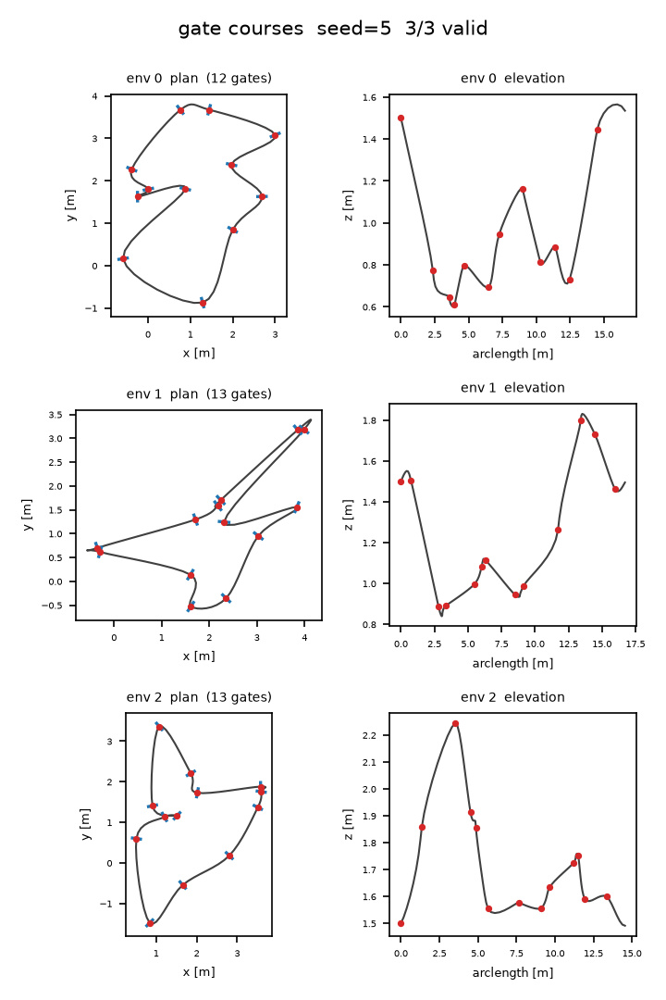

3D gate courses
===============

Gate sequences (``GateGenerator``, tutorial at :doc:`/tutorials/gate-sequences`) are
**2.5D**: the plan-view layout comes from the proven 2D centerline generators, and
altitude (Z) is layered on afterwards as a first-class profiler stage. The result is a
genuine 3D course — gates carry a ``vec3f`` position, a roll-free orientation
quaternion, and can be flown, localized, and collided against in three dimensions —
without giving up any of the 2D generators' layout quality or determinism. This page
covers the 2.5D design, the four ``z_profile`` families and their knobs, the two
``gate_align`` modes, the runtime parity with track mode, the validity rules, and the
breaking changes from the pre-3D API.

Why 2.5D
--------

The 2D gate pipeline is well understood: each native generator (``bezier``, ``hull``,
``polar``, ``voronoi``, ``checkpoint``) samples corner anchors, they are ordered and
bounding-box normalized, the :doc:`gate self-collision solve </relaxation/gates>`
separates overlapping gates, and tangents follow. All of that is a plan-view (XY)
computation and stays **bit-identical** to the 2D era.

Altitude is added as a separate stage that runs on the final ordered, relaxed 2D
anchors — *before* the lift to ``vec3f``. Concretely, in ``_run_gate_pipeline``
(``track_gen/_src/warp_gate.py``) the stage order is:

.. code-block:: text

   raw anchors → ordering → bbox normalization → SPHERE RELAXATION
       → Z PROFILE (writes per-gate z) → lift to vec3f → tangents → frames + validity

Keeping Z orthogonal to the XY layout is what makes the feature cheap and safe: the
plan-view generators are untouched, the Z stage is a single data-independent kernel
launch (graph-capturable, zero per-call allocation), and turning altitude off
(``z_profile="flat"`` with ``z_base=0``) reproduces the old planar course exactly.

Altitude profiles
-----------------

``GateGenConfig.z_profile`` selects the altitude family. All four write every real gate
slot and NaN the padding; the ``z_*`` knobs below are inert for the profiles they do not
apply to.

.. list-table::
   :header-rows: 1
   :widths: 18 52 30

   * - ``z_profile``
     - Altitude model
     - Knobs
   * - ``"flat"`` (default)
     - Every real gate sits at ``z_base``. With the default ``z_base=0`` this is the
       old planar course.
     - ``z_base``
   * - ``"uniform"``
     - Each gate's altitude is drawn i.i.d. uniform in ``[z_min, z_max]``.
     - ``z_min``, ``z_max``
   * - ``"random_walk"``
     - A Brownian-bridge walk clamped to ``[z_min, z_max]``, closed back to its start
       so the loop is continuous. Each step is capped by a **grade** — the maximum
       ``|dz|`` per unit of plan-view arc length — so altitude changes stay proportional
       to horizontal travel.
     - ``z_min``, ``z_max``, ``z_max_step`` (grade cap)
   * - ``"noise"``
     - Periodic harmonic noise oscillating around ``z_base``: a sum of
       ``z_noise_harmonics`` sinusoids of total amplitude ``z_noise_amplitude``, clamped
       to ``[z_min, z_max]``.
     - ``z_base``, ``z_noise_amplitude``, ``z_noise_harmonics`` (default 3),
       ``z_min``, ``z_max``

.. note::

   ``z_max_step`` is a **grade**, not an absolute step: it bounds ``|dz|`` per unit
   plan-view arc length between adjacent gates, so widely spaced gates may still differ
   in altitude by more than ``z_max_step``.

   Three gate courses rendered by ``viz/plot_gate_courses.py`` (``z_profile="random_walk"``,
   ``gate_align="full_tangent"``). Each env is drawn as a plan view (XY centerline plus
   per-gate left/right bars) and an elevation profile (arc length vs. z), with the closed
   :ref:`CourseLine <gates-3d-runtime>` spline threading the gates. Regenerate with
   ``python viz/plot_gate_courses.py --out docs/_static/gate-courses.png --envs 3 --seed 5``.

Gate alignment: ``gate_align``
------------------------------

Once each gate has an altitude, its **frame** (the roll-free orientation quaternion, with
local x = gate forward, y = left, z = up) is built from the tangent. ``gate_align``
chooses which tangent:

- ``"yaw_only"`` (default) uses the **plan-view** tangent — the 3D tangent projected onto
  the XY plane. The gate posts stay horizontal, so a gate's ``left`` and ``right``
  endpoints share the center's altitude. This is the natural choice for drone gates that
  hang level regardless of the course slope.
- ``"full_tangent"`` aligns the frame forward axis with the **full 3D** tangent, tilting
  the posts to follow the course's climb or descent. Use it when the gate plane should be
  perpendicular to the actual flight direction.

Either way the frame is roll-free (the up axis is kept as close to world-up as the
forward axis allows), and ``orientation`` is what the runtime, the collision frames, and
downstream consumers read — the removed ``normal`` field is recovered as
``wp.quat_rotate(orientation, wp.vec3f(0, 1, 0))`` when a left-axis vector is needed.

.. _gates-3d-runtime:

Runtime parity
--------------

A gates-mode :doc:`Course </utilities/course>` drives these 3D courses exactly like track
mode — **construct → bind → generate → step / reset** — with three additions that make
the third dimension first-class:

Pass detection
~~~~~~~~~~~~~~~

Progress is a **swept-segment plane-crossing** test: between two steps the agent's motion
segment is tested against the target gate's plane, and a pass is counted only when the
crossing falls inside the opening — within the left-right extent **and** vertically within
the gate's half-opening (``CheckpointSet.up_half``, aliased from ``GateSequence.half_size``).
Because track cross-sections use an effectively unbounded vertical half-opening, planar
motion behaves exactly as before; a gate course, by contrast, will not credit a pass for a
drone that flies over or under the gate. ``res.events`` still exposes ``passed``,
``dist_to_next``, and ``progress`` for reward shaping.

The track frame
~~~~~~~~~~~~~~~~

In gates mode ``course.step()`` returns a ``StepResult`` whose third field, ``res.frame``,
is a :class:`~track_gen.localize.TrackFrame` localizing the agent on a closed 3D
``CourseLine`` spline (a periodic Catmull-Rom curve through the gate centers). It carries
``s`` (arc length along the spline), ``n`` (signed lateral offset, positive to the right
of travel), ``n_up`` (signed vertical offset in the roll-free frame at the foot point), and
``segment`` (nearest spline segment). In track mode ``res.frame`` is ``None``.

Frame collision
~~~~~~~~~~~~~~~~

Beyond the ``post_radius`` gate-post discs, gates mode offers ``frame_collision=True``:
each square gate becomes four thin oriented frame members and a ``FrameChecker`` tests the
agent **sphere** against them in the gate's own 3D frame. It requires ``frame_thickness``,
``frame_depth``, and ``agent_radius`` all ``> 0`` and is **mutually exclusive** with
``post_radius > 0`` (choose discs *or* frames). The contact is a ``FrameContact``
(``hit``, ``depth``).

Validity
--------

The 2D layout validity checks are unchanged: a sequence is rejected for the same planar
reasons as before (degenerate counts, crossing gate bars under a positive ``gate_width``,
and so on). The 3D pipeline adds one altitude check:

- ``z_valid_grade`` — the maximum allowed ``|dz|/ds`` grade between adjacent gates
  (``ds`` = plan-view distance). A sequence with any adjacent pair steeper than this is
  marked invalid. ``z_valid_grade = 0`` (the default) **disables** the check.

Two v1 limitations are explicit by design:

1. **Plan-view self-crossings.** The track pipeline still rejects plan-view crossings, but
   a *gate course* may self-cross in XY on purpose — a stacked over/under section is a
   legitimate 3D course whose plan view crosses itself. Gate validity therefore does not
   reject XY crossings.
2. **Spline XY drift is unchecked.** Validity is evaluated on the gate anchors, not on the
   ``CourseLine`` spline that interpolates them. The Catmull-Rom curve can bow away from
   the straight anchor-to-anchor chords, and that drift is not checked against the layout —
   keep gate spacing sane if you rely on the spline staying near the anchors.

.. _gates-3d-migration:

Migration from the 2D API
-------------------------

The 3D data model is a breaking change relative to the pre-3D gate/track API. Verbatim
from the commit that introduced it:

.. admonition:: Breaking changes
   :class: warning

   ``GateSequence``/``Track`` geometry is ``vec3f``; ``GateSequence.normal`` removed,
   ``orientation`` (``quatf``) + ``half_size`` added; ``CheckpointSet`` gains ``up_half``;
   ``TrackFrame`` gains ``n_up``; bound position buffers are ``[E]`` ``vec3f``;
   ``Course.bind`` takes orientation quaternions instead of yaw. XY behavior is
   golden-verified bit-identical.

In practice:

- Reshape geometry arrays with a trailing ``3`` instead of ``2``:
  ``wp.to_torch(gates.position).view(E, G, 3)`` (likewise ``Track.center/outer/inner``).
  The ``z`` component is 0 for the planar track pipeline and carries real altitude for
  gate courses.
- Replace ``GateSequence.normal`` reads with ``orientation`` (a ``quatf`` pose) plus
  ``half_size``; recover the old left-normal as
  ``wp.quat_rotate(orientation, wp.vec3f(0, 1, 0))``.
- Bind ``vec3f`` position buffers and pass ``Course.bind(position=..., orientation=...,
  half_extents=...)`` with an ``[E * max_boxes]`` ``quatf`` orientation buffer (identity
  quaternion ``(0, 0, 0, 1)`` if you have no rotation) instead of a ``yaw`` float array.

See also
--------

- :doc:`/tutorials/gate-sequences` — the end-to-end gate-generation recipe and output
  fields, including the RL runtime loop.
- :doc:`/relaxation/gates` — the plan-view gate self-collision solve that runs before the
  Z profile.
- :doc:`/utilities/course` — the ``Course`` facade that turns gates into checkpoints, the
  3D localizer, and optional post/frame collision.
