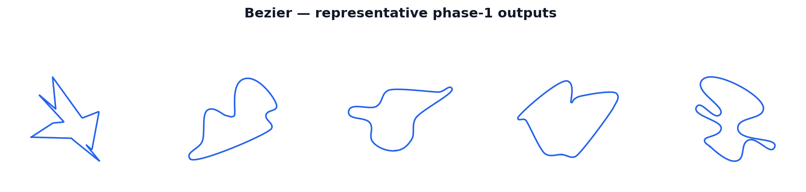

:orphan:

Bezier Generator
================

The ``bezier`` generator is the default and most configurable first-stage method.
It samples a set of random grid-jittered corner anchors, sorts them by angle around
their centroid to form a simple star-shaped polygon, and assembles a closed cubic
Bézier spline through those corners.  Handle lengths are proportional to
``rad * chord`` and adaptively clamped so that no handle overshoots a nearby corner.
An optional per-environment style draw broadens the shape family within a single batch.
Any smooth curve that still self-crosses after clamping is rescued by its provably
simple corner polygon, which the downstream XPBD solver re-rounds.

   Sample tracks produced by the Bezier generator at the default configuration.

How It Works
------------

The generator runs a fixed sequence of Warp kernels in a single pass — no
host-side retry loop, no per-environment Python branching:

1. **Optional style draw.**  When ``style_sampling=True``, a dedicated kernel draws
   per-environment ``rad``, ``scale``, and ``handle_clamp_frac`` values from their
   respective ``*_range`` fields using RNG salt ``2741``.  A range of ``None``
   collapses to the corresponding scalar, so individual knobs can stay fixed while
   others vary.  This Python branch is resolved at CUDA-graph capture time; the
   per-environment values are device arrays and the captured graph remains static.

2. **Corner count.**  ``_corner_count_sample_k`` draws ``count[e]`` uniformly from
   ``[min_num_points, max_num_points]`` for each environment using RNG salt ``6151``.

3. **Corner positions.**  ``_corner_sample_k`` (or ``_corner_sample_style_k`` when
   style-sampling is active) samples ``max_num_points`` grid cells from a
   ``num_cells × num_cells`` grid where
   ``num_cells = int(1 / (min_point_distance * 2))``.  Each cell selection uses
   bounded duplicate rejection (up to eight retries per corner) to spread corners
   across distinct cells, then adds per-axis sub-cell jitter.  Coordinates are
   multiplied by ``scale`` (or by the per-environment ``scale[e]`` in style mode).
   RNG salt for positions: ``9781``.

4. **Prune-then-sort.**  ``_ccw_sort_k`` sorts only the first ``count[e]`` corners by
   ``atan2`` angle around the centroid of those same kept corners (not all
   ``max_num_points`` slots), writing NaN past the live count.  Sorting *after*
   pruning matters: sorting all ``max_num_points`` points and keeping a prefix would
   compute the centroid over unpruned slots, producing angular wedges around the wrong
   centroid that can close as figure-eight loops.

5. **Vertex tangents.**  ``_vertex_tangents_k`` computes each corner's tangent as a
   normalized blend of the outgoing unit edge direction ``u_out`` and the incoming unit
   edge direction ``u_in``, weighted by ``p = atan(edgy) / π + 0.5``.  At the default
   ``edgy=0``, ``p=0.5`` gives a symmetric bisector tangent.  It also records each
   corner's shorter incident edge length for the adaptive clamp (step 6).

6. **Cubic Bézier assembly.**  ``_assemble_k`` emits ``num_points_per_segment`` dense
   samples for each closed edge (corner ``i`` to corner ``(i+1) % count[e]``),
   including the wrap-around closing edge.  For each segment the handle lengths are
   computed as:

   .. math::

      h_0 = \min\!\bigl(\texttt{rad} \cdot \text{chord},\;
                         \texttt{handle\_clamp\_frac} \cdot \min_{\text{adj}}(e_0)\bigr)

   .. math::

      h_1 = \min\!\bigl(\texttt{rad} \cdot \text{chord},\;
                         \texttt{handle\_clamp\_frac} \cdot \min_{\text{adj}}(e_1)\bigr)

   where :math:`\min_{\text{adj}}(e)` is the length of the shorter incident edge at
   that corner.  The cubic control points are then:

   .. math::

      P_1 = c_0 + \hat{t}_0 \cdot h_0, \qquad
      P_2 = c_1 - \hat{t}_1 \cdot h_1

   and the segment is evaluated via the standard Bernstein basis (see Math section).
   In style mode ``_assemble_style_k`` reads ``rad[e]`` and ``handle_clamp_frac[e]``
   from the per-environment device arrays drawn in step 1.

7. **Dense-to-N arc-resample.**  ``_arc_resample_inplace`` converts the dense
   ``max_num_points × num_points_per_segment`` loop to exactly ``num_points``
   arc-uniformly spaced samples, building cumulative arc length in ``float64`` and
   interpolating with a searchsorted lookup.

8. **Self-intersection check and fallback.**  ``self_intersections_inplace`` counts
   proper crossings on the ``num_points``-point resampled loop.  For environments
   where the Bézier curve self-crosses, ``_assemble_polygon_selected_k`` emits the
   straight corner polygon (equivalent to ``handle_clamp_frac=0``) and
   ``_arc_resample_selected_inplace`` overwrites only those rows.
   ``_select_vec2_k`` then writes the Bézier result for non-crossers and the polygon
   result for crossers into the output buffer.

9. **Generation flag.**  All environments are marked ``out_valid_wp=1`` unconditionally.
   The generation gate is always True; geometric validity is decided later by the
   shared post-relax inflation gate.

Math
----

**Cubic Bézier segment.**  Each corner-to-corner segment is a standard degree-3
Bézier curve parameterised by :math:`t \in [0, 1]`:

.. math::

   B(t) = (1-t)^3 P_0 + 3(1-t)^2 t\, P_1 + 3(1-t)t^2 P_2 + t^3 P_3

where :math:`P_0 = c_0` and :math:`P_3 = c_1` are the adjacent corner anchors, and
:math:`P_1`, :math:`P_2` are the interior control (handle) points constructed below.

**Vertex tangent blend.**  The tangent direction at corner :math:`i` is:

.. math::

   p = \frac{\arctan(\texttt{edgy})}{\pi} + 0.5,
   \qquad
   \hat{t}_i = \operatorname{normalize}\!\bigl(p\,\hat{u}^{\text{out}}_i
               + (1-p)\,\hat{u}^{\text{in}}_i\bigr)

where :math:`\hat{u}^{\text{out}}_i` is the unit vector from corner :math:`i` to
corner :math:`i{+}1` and :math:`\hat{u}^{\text{in}}_i` is the unit vector from corner
:math:`i{-}1` to corner :math:`i`.  At ``edgy=0``, :math:`p = 0.5` and the tangent
bisects the two edge directions symmetrically.  As ``edgy`` grows, :math:`p \to 1`
and the tangent aligns with the outgoing edge, sharpening the exit from each corner.

**Handle construction.**  For each segment from :math:`c_0` to :math:`c_1` with
chord :math:`\|c_1 - c_0\|`:

.. math::

   h_i = \min\!\bigl(\texttt{rad} \cdot \|c_1 - c_0\|,\;
                      \texttt{handle\_clamp\_frac} \cdot l_{\min,i}\bigr)

where :math:`l_{\min,i}` is the shorter of the two edges incident at corner :math:`i`.
The interior control points follow:

.. math::

   P_1 = c_0 + \hat{t}_0 \cdot h_0, \qquad
   P_2 = c_1 - \hat{t}_1 \cdot h_1

The clamp prevents :math:`h_i` from exceeding ``handle_clamp_frac`` times the
shorter adjacent edge, so a long handle cannot overshoot a nearby corner and cause
a self-crossing.

Parameters
----------

All fields are part of ``TrackGenConfig`` (see the Configuration reference for the
full list, defaults, and validation rules).

``min_num_points``
    Minimum corner-anchor count per environment.  Must be >= 2.

``max_num_points``
    Maximum corner-anchor count per environment.  A wider range adds more
    per-environment shape diversity.  Also sets the buffer stride ``P``.

``num_points_per_segment``
    Dense Bézier samples emitted per corner-to-corner segment before arc-resampling.
    Must be >= 2; higher values give the arc-resampler a finer cumulative-arc-length
    grid, reducing interpolation error.

``min_point_distance``
    Minimum grid-cell spacing for corner sampling.  Controls the corner grid as
    ``num_cells = int(1 / (min_point_distance * 2))``.  Must be in ``(0, 0.5]``.

``min_angle``
    Minimum interior angle (radians) at constrained corners.  Used by the gate-angle
    validity kernel; not applied directly to centerline generation on the current
    single-pass path.

``rad``
    Handle length as a fraction of the segment chord — the primary curviness dial.
    Only live when ``rad <= handle_clamp_frac``; if ``rad`` exceeds the clamp,
    ``handle_clamp_frac`` binds every segment and ``rad`` has no independent effect.

``edgy``
    Corner-tangent blend weight.  Converted as ``p = atan(edgy) / π + 0.5``.
    At the default ``0.0``, ``p = 0.5`` gives a symmetric bisector tangent; larger
    positive values push ``p`` toward 1, making turns asymmetrically sharper
    (outgoing-edge-dominant).

``scale``
    Isotropic scale multiplier applied to sampled corner positions.  Scales all
    track coordinates; interacts with ``spacing`` and ``half_width`` through the
    coordinate range.

``handle_clamp_frac``
    Adaptive handle clamp.  Each corner's handle is capped at
    ``handle_clamp_frac × (its shorter incident edge)`` to prevent overshoot past
    a nearby corner.  Set equal to ``rad`` (the default ``0.4``) so the clamp only
    trims genuine overshoot; set below ``rad`` to bind every handle regardless of
    ``rad`` (near-polygonal tracks); set very large to disable.

``style_sampling``
    Opt-in per-environment Bézier style randomisation (default ``False``).  When
    ``True``, each environment draws its own ``rad``, ``scale``, and
    ``handle_clamp_frac`` from the ``*_range`` fields, so a single batch spans a
    family of styles.

``rad_range``
    ``(lo, hi)`` range for per-environment ``rad`` when ``style_sampling=True``.
    ``None`` collapses to the scalar ``rad`` for all environments.

``scale_range``
    ``(lo, hi)`` range for per-environment ``scale`` when ``style_sampling=True``.
    ``None`` collapses to the scalar ``scale`` for all environments.

``handle_clamp_frac_range``
    ``(lo, hi)`` range for per-environment ``handle_clamp_frac`` when
    ``style_sampling=True``.  ``None`` collapses to the scalar ``handle_clamp_frac``
    for all environments.

What Makes It Distinct
----------------------

The Bezier generator is the **default** and most knob-rich of the five generators:

- **Widest style control.** Nine primary knobs (``min_num_points``, ``max_num_points``,
  ``num_points_per_segment``, ``min_point_distance``, ``min_angle``, ``rad``, ``edgy``,
  ``scale``, ``handle_clamp_frac``) plus the opt-in ``style_sampling`` family are all
  exclusive to the corner-Bézier representation.  No other generator exposes per-env
  handle geometry or a per-batch style sweep.

- **Cubic Bézier representation.** Compared to the **hull** generator (which uses a
  closed uniform Catmull-Rom spline) and the **polar** generator (also Catmull-Rom),
  the Bézier formulation gives explicit, per-corner handle control through ``rad`` and
  ``edgy``.  The hull generator adds radial midpoint displacement for pronounced lobes
  and pinches; the Bézier generator keeps the shape entirely corner-determined.

- **Star-shaped corner families.** Like the hull generator the Bézier generator samples
  Cartesian corners and angle-sorts them.  Unlike the **polar** generator, which starts
  from polar control knots and is smooth and centered by construction, and unlike the
  **voronoi** generator, which snaps anchors to a pre-sampled site field, the Bézier
  generator's shapes are anchored to sampled grid corners and are roughly star-shaped
  around the corner centroid.  Unlike the **checkpoint** generator — which steers a
  bounded-turn path through radial checkpoints and produces organically curving loops —
  the Bézier generator is purely geometric and not trajectory-based.

- **Lowest relaxation burden at the default config.** At the default
  ``handle_clamp_frac=0.4`` (matching ``rad=0.4``) and fat-band settings the valid
  yield is approximately 99.9 % end-to-end, and the generator produces consistently
  smooth, well-spaced centerlines before relaxation begins.

Fallback and Validity
---------------------

**Local polygon fallback.**  After arc-resampling to ``num_points``, any environment
whose Bézier centerline contains at least one proper self-crossing is redirected to its
provably simple corner polygon (straight line segments between the sorted corners).
Only the affected environments are reprocessed; non-crossing environments are
unaffected.  The XPBD bead-chain solver then re-rounds the polygon fallback through its
bending and separation corrections.

**Generation-stage validity.**  The generator writes ``out_valid_wp=1`` for every
environment unconditionally.  The generation stage does not gate on geometry.  Turning
number, track thickness, NaN presence, and width-floor checks are all evaluated later
by the shared post-relax inflation validity gate (``_validity_k`` inside
``inflate_warp``).  The final ``Track.valid`` field therefore reflects post-relax
geometric quality, not generation success.
