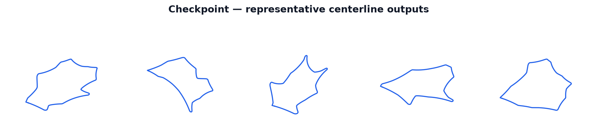

:orphan:

Checkpoint Generator
====================

The checkpoint generator produces organic, continuously undulating closed loops by steering
a bounded-turn path through a ring of random radial checkpoints.  It is the only generator
in ``track_gen`` that derives its shape from a proportional-gain steering walk, making it the
natural fit for CarRacing-style circuits that flow continuously around the track rather than
snapping between corner anchor points.

   Tracks produced by the checkpoint generator (``generator="checkpoint"``).

How It Works
------------

1. **Sample checkpoint ring.**  ``_sample_checkpoints_k`` draws ``C = checkpoint_count``
   checkpoints, one per angular slot, at angles ``2*pi*c/C + jitter`` (bounded by
   ``checkpoint_angle_jitter * slot``, approximately angle-ordered so the steered path winds
   exactly once around) on radii drawn uniformly from
   ``[checkpoint_radius_min_frac * R, R]`` with ``R = 1``.  The sampling is repeated
   independently for each of the ``K`` decorrelated candidates using per-candidate RNG
   salt offsets.

2. **Fixed N-step bounded-turn steering walk.**  ``_steer_k`` walks a fixed
   ``num_points``-step open path.  The step length ``dl = ring_perimeter / N`` (where
   ``ring_perimeter`` is the closed polygon perimeter over the sampled checkpoints) pins
   the walk to approximately one full lap without an over-generate-and-trim step.  The
   walk starts at checkpoint 0 heading toward checkpoint 1.  At every step the proportional
   steering error ``err = wrap(bearing - theta)`` is computed, the heading change is clamped
   to ``+/- checkpoint_turn_rate``, and the position is advanced by
   ``dl * (cos(theta), sin(theta))``.  The target checkpoint index advances by one when the
   current position is within ``checkpoint_lookahead_frac * R`` of the current target,
   cycling modulo ``C`` so the walk chases each checkpoint in order.

3. **Additive heading-ramp closure.**  ``_close_heading_ramp_k`` closes the open steered
   path to turning number 1 without altering the local curvature character of the loop.  It
   computes the sum of all wrapped heading increments over the closed edge ring, then adds a
   constant drift ``(2*pi - net_turn) / N`` to every step's heading increment so the net
   cumulative turn is exactly ``2*pi``.  Headings are rebuilt from the corrected increments,
   the mean edge vector is subtracted (gap-distribution closure), and positions are recovered
   by cumsum and then recentered by their centroid.  Two alternative closures were rejected:
   multiplicative rescaling of heading increments flattened the loop toward a blob, and
   gap-closing in position space produced self-crossings.

4. **Best-of-K candidate selection.**  With ``checkpoint_best_of_k`` (``K``, default 4)
   greater than one, ``K`` independently seeded candidates are generated per environment in
   parallel.  ``_select_best_k`` performs a deterministic argmin over each environment's
   ``K`` per-candidate self-intersection counts, keeping the least-crossing candidate
   (ties broken by the lowest candidate index ``k``).  When ``K = 1`` a direct copy
   (``_copy_single_k``) is used instead, skipping the intersection scoring entirely.
   ``K = 4`` gives approximately zero pre-relax self-intersections at the default
   configuration.

5. **Optional single-crossing clip fallback.**  When ``checkpoint_clip_fallback = True``
   (off by default), ``_clip_assemble_k`` rescues any selected centerline that still
   contains a self-crossing by finding the first crossing segment pair, computing the
   intersection point ``P``, splitting the loop into an inner and an outer sub-loop at
   ``P``, and keeping the longer of the two simple sub-loops by arc length.  The kept
   sub-loop is then arc-resampled back to ``num_points``.  This is a capture-time Python
   branch; the CUDA graph stays fixed regardless.

6. **Bounding-box normalization.**  ``_normalize_centerline_k`` centers each environment
   by its bounding box and isotropically scales the longest bounding-box dimension to
   ``scale * 1.44``, matching the Bezier baseline's typical longest extent so the shared
   resample, relaxation, and inflate stages see comparable coordinate ranges across
   generators.

Math
----

**Checkpoint placement.**  Checkpoint ``c`` (zero-indexed, ``c = 0, ..., C-1``) is placed
at angle and radius:

.. math::

   \theta_c = \frac{2\pi c}{C} + \varepsilon_c,
   \qquad |\varepsilon_c| \leq \texttt{checkpoint\_angle\_jitter} \cdot \frac{2\pi}{C}

.. math::

   r_c \sim U\!\left(\,f \cdot R,\; R\right),
   \qquad f = \texttt{checkpoint\_radius\_min\_frac},\quad R = 1

The jitter bound keeps the sequence strictly angle-monotone (no angular slot is crossed),
so the steered path is guaranteed to wind once around.

**Steering step.**  The step length is fixed to the checkpoint polygon perimeter divided by
``N``:

.. math::

   dl = \frac{L_{\mathrm{ring}}}{N},
   \qquad L_{\mathrm{ring}} = \sum_{c=0}^{C-1} \|\mathbf{p}_{c+1} - \mathbf{p}_c\|

where indices wrap modulo ``C``.  At each step:

.. math::

   \mathrm{err} = \operatorname{wrap}(\mathrm{bearing} - \theta),
   \qquad
   \Delta\theta = \operatorname{clamp}\!\bigl(g \cdot \mathrm{err},\; -\tau,\; +\tau\bigr)

with :math:`g = \texttt{checkpoint\_steer\_gain}` and
:math:`\tau = \texttt{checkpoint\_turn\_rate}`.  The heading is updated as
:math:`\theta \leftarrow \theta + \Delta\theta` and the position advances by
:math:`dl \cdot (\cos\theta,\, \sin\theta)`.

**Additive closure ramp.**  Let :math:`\sum_i \Delta\theta_i` be the sum of all wrapped
heading increments around the closed edge ring.  A constant drift is computed and added to
every step:

.. math::

   \delta = \frac{2\pi - \sum_{i} \Delta\theta_i}{N}

After applying the drift, the net cumulative heading change is exactly :math:`2\pi`
(turning number 1, no inner loops).  Because the drift is additive — not a rescaling of
existing increments — the steered sweeps and inlets in the local curvature are preserved.
Positions are then recovered by integrating unit-length edge vectors and subtracting the
mean edge (gap-distribution closure), followed by recentering by the centroid.

Parameters
----------

All parameters below are fields on ``TrackGenConfig`` and apply only when
``generator = "checkpoint"``.  See the configuration reference for types, defaults, and
validation rules.

``checkpoint_count`` (int, default 12)
    Number of radial checkpoints ``C``.  Must be >= 3.  More checkpoints produce wavier
    tracks with more chicanes; fewer produce calmer, rounder loops.  The CarRacing
    canonical default is 12.

``checkpoint_radius_min_frac`` (float, default 0.33)
    Inner-radius fraction for checkpoint placement.  Checkpoint radii are drawn from
    ``U(checkpoint_radius_min_frac * R, R)`` with ``R = 1``.  Must be in ``[0, 1)``.
    The CarRacing canonical value 0.33 gives the characteristic inlets.

``checkpoint_angle_jitter`` (float, default 0.55)
    Angular jitter as a fraction of the per-checkpoint angular slot ``2*pi/C``.
    Must be below 1.0 (enforced in Python before launch) so each checkpoint stays within
    its nominal angular slot. Values above 0.5 allow adjacent checkpoints to swap angular
    positions; the steering walk still completes approximately one lap by chasing checkpoints
    in index order, but strict angle-monotonicity is not guaranteed at the default of 0.55.
    Larger values produce more irregular spacing and more varied corner geometry.

``checkpoint_turn_rate`` (float, default 0.42)
    Maximum heading change in radians per steering step.  Bounds path curvature: too
    large allows sharp kinks; too small prevents the path from tracking tight inlets.

``checkpoint_steer_gain`` (float, default 0.65)
    Proportional steering gain toward the current target bearing.  Coupled to one lap by
    the fixed step length ``dl``; values in ``(0, 1]`` are typical.  Higher values chase
    each checkpoint more aggressively.

``checkpoint_lookahead_frac`` (float, default 0.16)
    Advance-to-next-checkpoint threshold as a fraction of outer radius ``R``.  The walk
    moves to the next checkpoint once within ``checkpoint_lookahead_frac * R`` of the
    current target, preventing the path from stalling at each checkpoint.

``checkpoint_best_of_k`` (int, default 4)
    Number of decorrelated candidates generated per environment.  Must be >= 1.  The
    candidate with the fewest self-intersections is selected (deterministic argmin, ties
    broken by lowest candidate index).  ``K = 4`` is the bounded, graph-capturable
    replacement for CarRacing's unbounded reject-retry loop.

``checkpoint_clip_fallback`` (bool, default ``False``)
    Opt-in single-crossing clip fallback.  When ``True``, the first self-crossing of the
    selected centerline is clipped: the loop is split at the intersection point, the
    longer simple sub-loop is kept, and it is arc-resampled back to ``num_points``.
    Must be set consistently between ``alloc_scratch`` and ``generate`` since the clip
    buffers are only allocated when the flag is ``True`` at alloc time.

What Makes It Distinct
----------------------

The checkpoint generator is the **only steering-walk generator** in ``track_gen``.
Whereas the Bezier, hull, polar, and Voronoi generators all start from a set of anchor
points and smooth or interpolate between them — producing shapes that are broadly
star-shaped around an anchor centroid — the checkpoint generator builds its shape by
integrating a bounded-curvature heading signal.  The result is an organic, continuously
undulating loop without prominent spoke directions or angular corner signatures.

The **additive heading-ramp closure** is the key design decision that separates this
generator from a naive steering loop.  Closing in position space (e.g., linearly
interpolating toward the start point) introduces self-crossings.  Multiplicative
rescaling of heading increments (scaling all turns uniformly so they sum to
:math:`2\pi`) flattens the local curvature and collapses the organic shape toward a
near-circle blob.  The additive drift preserves the steered sweeps and inlets while
guaranteeing turning number 1.

**Best-of-K selection** is the graph-capturable analogue of CarRacing's unbounded
reject-retry: rather than re-generating until a clean loop is found, ``K`` decorrelated
candidates are generated in one fixed-shape pass and scored by self-intersection count.
At the default ``K = 4`` and default steering parameters, the pre-relax self-intersection
rate is near zero without any host-side branching.

The checkpoint generator sits in the **medium-high compactness** range (approximately
0.61), between the compact Voronoi family and the lower-compactness Bezier and hull
families.  Its continuously curving character and lack of straight sections or sharp
corners make it well-suited to CarRacing-style reinforcement-learning environments.

Fallback and Validity
---------------------

The checkpoint generator's primary quality mechanism is **best-of-K selection**:
generating ``K`` candidates per environment and keeping the least-self-intersecting one.
At ``K = 4`` with default parameters, pre-relax self-intersections are effectively
eliminated without any host-side retry loop.

The **opt-in clip fallback** (``checkpoint_clip_fallback = True``) provides a
shape-preserving secondary rescue for any remaining self-crossers in the selected
centerline.  It is off by default (like the polar generator, which also has no
generator-local fallback); the downstream post-relax validity gate handles any residual
bad geometry.

As with all generators, ``out_valid_wp`` is filled with ``1`` for every environment at
generation time.  Final geometric validity — turning number, minimum thickness, NaN
checks, and optional border intersection checks — is decided later by the shared
``inflate_warp`` stage after constant-spacing resample and XPBD relaxation.  The
generation flag is a stage flag, not a quality certificate.
