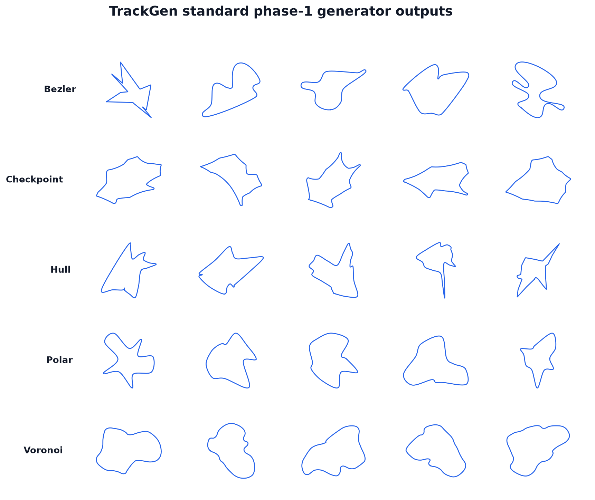

Generators Overview
===================

``track_gen`` ships six registered first-stage centerline generators.
Each generator is pluggable through ``TrackGenConfig.generator`` and follows the same
pipeline contract: it writes one closed centerline per environment, then the shared
resample → XPBD relax → inflate → validity stages take over — except ``repulsive``, which
is not CUDA-graph-capturable (see below).

   Sample tracks from the six generators (one row per generator).

The Six Generators
-------------------

bezier
~~~~~~

Samples random grid-jittered corners, sorts them by angle around their centroid,
and assembles a closed cubic Bézier spline.  Handle lengths are proportional to
``rad * chord`` and clamped by ``handle_clamp_frac`` so handles cannot overshoot
nearby corners.  Optional ``style_sampling`` draws per-environment ``rad``,
``scale``, and ``handle_clamp_frac`` from configured ranges, broadening the shape
family without changing the representation.  Self-crossing smooth curves fall back
to their provably simple corner polygon, which XPBD re-rounds.
See :doc:`bezier` for the full deep dive.

hull
~~~~

Angle-sorts a set of randomly sampled points around their centroid — a static
stand-in for a convex hull — then interleaves each adjacent pair of sorted vertices
with one radially displaced midpoint.  The augmented loop is smoothed by a closed
uniform Catmull-Rom spline.  ``hull_displacement`` controls how strongly midpoints
are pushed outward (lobes) or inward (pinches and straights).  Catmull-Rom
self-crossers fall back to an arc-resampled straight augmented polygon.
See :doc:`hull` for the full deep dive.

polar
~~~~~

Builds ``polar_num_knots`` control knots in polar coordinates: each knot starts at
an evenly spaced angle, receives bounded angular and radial jitter, and the resulting
sequence is smoothed by a closed uniform Catmull-Rom spline.  The output is
bounding-box normalized to the shared target extent.  Because the shape is smooth
and centered by construction, polar carries the lowest relaxation burden of the five
generators and has no generator-local fallback.
See :doc:`polar` for the full deep dive.

voronoi
~~~~~~~

Draws a fixed site field under one of four layouts (``ring``, ``void_ring``,
``clustered``, ``mixed``) and selects ``voronoi_control_points`` anchor sites by
snapping angular sector targets — jittered by ``voronoi_angular_jitter`` with radius
modulated by ``voronoi_radial_variation`` — to the nearest unused site.  The anchor
cycle is rounded by one Chaikin subdivision and a closed Catmull-Rom pass, then
arc-resampled.  Self-crossing smooth loops fall back to the selected anchor polygon.
The ``void_ring`` default produces the highest compactness of the five generators.
See :doc:`voronoi` for the full deep dive.

checkpoint
~~~~~~~~~~

Steers a bounded-turn path through ``checkpoint_count`` radial checkpoints drawn at
uniformly spaced angles with bounded jitter, producing an organic, continuously
undulating loop unlike the star-shaped families.  A fixed ``num_points``-step walk
with heading gain ``checkpoint_steer_gain`` and per-step turn clamp
``checkpoint_turn_rate`` replaces CarRacing's unbounded retry loop.  An additive
heading-ramp closure ensures the net turning number is exactly one (no inner loops)
while preserving the steered local curvature.  Best-of-K selection (default K=4)
keeps the least-self-intersecting of K decorrelated candidates per environment;
an optional single-crossing clip fallback is available but off by default.
See :doc:`checkpoint` for the full deep dive.

repulsive
~~~~~~~~~

Grows each centerline from a small seed circle under a hard ratcheting length constraint,
using a tangent-point energy and a Sobolev-preconditioned flow to keep the curve
self-avoiding while it is confined to a disc domain seeded with random obstacles —
coarse-to-fine (``N = 64 → 128 → 256``) with an area-based stall-stop.  It is the only
generator built from iterative physical simulation rather than a single deterministic
sampling + smoothing pass, and produces the foldiest, most serpentine circuits of the six
(compactness ≈ 0.15).  It is also the first generator that is **not CUDA-graph-capturable**
(``capturable=False``): its host-side stage transitions and stall-stop readback are illegal
inside a capture region, so it runs eagerly on CUDA every call —
roughly **1000× slower** than ``bezier`` (~0.2 s @ E=64, ~5 s @ E=8192 on an RTX 4090).
Prefer a slow regeneration cadence or staggered per-env slices over calling ``generate()``
every step. See :doc:`repulsive` for the full deep dive.

When to Use Which
-----------------

.. list-table::
   :header-rows: 1
   :widths: 15 30 20 35

   * - Generator
     - Shape character
     - Typical compactness
     - Best suited for
   * - ``bezier``
     - Star-shaped corner families; smooth cubic curves
     - Low (~0.44)
     - General-purpose diversity; most configurable style knobs
   * - ``hull``
     - Angle-sorted loop with radial lobes and pinches
     - Low (~0.43)
     - Tracks with pronounced lobes, pinches, or straight sections
   * - ``polar``
     - Smooth periodic radial spline; centered by construction
     - Medium (~0.56)
     - Low-burden contrast to corner families; fast, symmetric shapes
   * - ``voronoi``
     - Graph-cycle anchored to a site field; compact and feature-rich
     - High (~0.73)
     - Complex, compact layouts; largest lap-time variety
   * - ``checkpoint``
     - Flowing organic loop from bounded-turn steering
     - Medium-high (~0.61)
     - Organic circuit feel; CarRacing-style continuously curving tracks
   * - ``repulsive``
     - Dense, foldy serpentine from self-repulsive growth
     - Very high (~0.15)
     - Maze-like circuits; **only** when the ~1000× generation cost (non-graph-captured,
       see :doc:`repulsive`) fits your regeneration cadence

Generator Contract
------------------

A generator produces the initial closed centerline fed to the shared pipeline.
It implements two callables: ``alloc_scratch(config)`` allocates fixed-shape,
generator-private Warp buffers once at construction time, and
``generate(seeds_wp, config, out_centerline, out_valid_wp, scratch)`` writes one
closed centerline per environment into the orchestrator-owned output buffer in place.
The hot path must be pure Warp and deterministic in ``(seed, config)``.  For the five
``capturable=True`` generators it must additionally be zero-allocation inside ``generate``
and CUDA-graph-capturable — no host-side retry loop, no host branch on generated tensor
data, and no per-environment Python branching inside ``generate``.  A generator may instead
declare ``capturable=False`` (currently only ``repulsive``) to use host-side control flow
and per-call allocation; it then runs eagerly on CUDA every call instead of being captured
into a replayable graph.  Generators set ``out_valid_wp`` to ``1`` for every environment at
this stage; final geometric validity (turning number, thickness, NaN checks) is decided
later by the shared post-relax inflation validity gate.  The full contract, hard rules, and
registration instructions are documented in :doc:`/contributing/writing-a-generator`.
