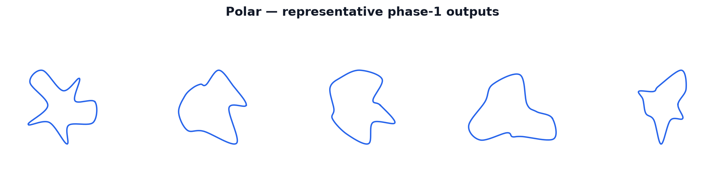

Polar Generator
===============

The **polar** generator produces smooth, closed, radially symmetric track
centerlines by placing a fixed number of control knots in polar coordinates,
fitting a periodic cubic spline through them, and normalizing the result to a
shared coordinate extent. Because the representation starts in polar form, the
loop is smooth and centered by construction — no post-generation sorting,
centroid correction, or polygon fallback is required.

   Representative centerlines produced by the polar generator.

How It Works
------------

1. **Control knot sampling.** The kernel ``_polar_controls_k`` draws
   ``K = polar_num_knots`` control knots using an RNG stream seeded by
   ``seeds[e] * 7919 + 17`` (salt ``7919`` is the polar stream constant;
   ``+17`` is the control-specific offset). For each knot index
   ``i`` in ``0 … K-1``:

   - The nominal angle is ``2π i / K``.
   - A bounded angular offset ``angle_delta`` is drawn from
     ``(-angular_jitter, +angular_jitter)`` and added: if the jitter fraction
     is kept below ``0.5`` (enforced by Python before launch), the fixed index
     order remains the sorted angular order without a runtime sort.
   - A radial offset ``radial_delta`` is drawn from
     ``(-radial_jitter, +radial_jitter)`` and applied relative to
     ``base_radius = 1.0``. The radius is clamped to at least ``0.1 *
     base_radius`` so knots never collapse to the origin.

2. **Closed Catmull-Rom spline.** ``_polar_spline_dense_k`` evaluates a closed
   uniform Catmull-Rom spline through the ``K`` knots, producing
   ``K * num_points_per_segment`` dense samples per environment. Samples are
   endpoint-excluded within each segment; the arc resampler closes the final
   segment back to the first knot.

3. **Arc-length resampling.** ``_arc_resample_inplace`` (from the shared
   pipeline module) converts the dense periodic spline to exactly
   ``num_points`` arc-uniformly spaced points.

4. **Bounding-box normalization.** ``_normalize_centerline_k`` centers each
   environment's loop by its bounding-box centroid and isotropically rescales
   so the longest bounding-box dimension equals ``scale * 1.44``. The ``1.44``
   constant matches the Bézier baseline's typical per-environment longest
   bounding-box extent at ``scale = 1.0``, ensuring that ``half_width``,
   constant spacing, and XPBD relaxation see comparable coordinate ranges
   across all generators.

5. **Validity flag.** The generator writes ``out_valid_wp = 1`` for every
   environment. It has no local polygon fallback; any rare bad geometry is
   handled by the shared post-relax validity gate.

Math
----

**Knot polar coordinates.** For knot index :math:`i \in \{0, \ldots, K-1\}`:

.. math::

   \theta_i = \frac{2\pi i}{K} + \epsilon_i^{(\theta)},
   \qquad |\epsilon_i^{(\theta)}| < \frac{2\pi\,\alpha}{K},\quad \alpha = \texttt{polar\_angular\_jitter} < 0.5

.. math::

   r_i = R_\text{base} \cdot \max\!\bigl(1 + \epsilon_i^{(r)},\; 0.1\bigr),
   \qquad |\epsilon_i^{(r)}| \leq \delta_r

where :math:`\alpha` is the dimensionless ``polar_angular_jitter`` fraction (clamped to
``[0, 0.45]``, strictly below ``0.5`` so the fixed index order remains the sorted angular
order without a runtime sort), :math:`\delta_r` is ``polar_radial_jitter``, and
:math:`R_\text{base} = 1.0` (a pre-normalization working radius). The Cartesian knot position is:

.. math::

   \mathbf{p}_i = \bigl(r_i \cos\theta_i,\; r_i \sin\theta_i\bigr)

**Closed uniform Catmull-Rom spline.** The dense spline is evaluated as:

.. math::

   \mathbf{C}(u) = \tfrac{1}{2}
   \begin{bmatrix} 1 & u & u^2 & u^3 \end{bmatrix}
   \begin{bmatrix}
     0 &  2 &  0 &  0 \\
    -1 &  0 &  1 &  0 \\
     2 & -5 &  4 & -1 \\
    -1 &  3 & -3 &  1
   \end{bmatrix}
   \begin{bmatrix} \mathbf{p}_{i-1} \\ \mathbf{p}_i \\ \mathbf{p}_{i+1} \\ \mathbf{p}_{i+2} \end{bmatrix}

for :math:`u \in [0, 1)` within segment :math:`i`, with indices taken modulo
:math:`K` for the closed (periodic) loop. This is equivalent to the
scalar form implemented in ``_catmull_rom``:

.. math::

   \mathbf{C}(u) = \tfrac{1}{2}\bigl[
     2\mathbf{p}_i
     + (-\mathbf{p}_{i-1} + \mathbf{p}_{i+1})\,u
     + (2\mathbf{p}_{i-1} - 5\mathbf{p}_i + 4\mathbf{p}_{i+1} - \mathbf{p}_{i+2})\,u^2
     + (-\mathbf{p}_{i-1} + 3\mathbf{p}_i - 3\mathbf{p}_{i+1} + \mathbf{p}_{i+2})\,u^3
   \bigr]

**Normalization.** After arc-length resampling to :math:`N` points, each
environment is centered by its bounding-box midpoint and isotropically scaled so
that:

.. math::

   \max(\Delta x,\, \Delta y) = \texttt{scale} \times 1.44

where :math:`\Delta x = x_\max - x_\min` and :math:`\Delta y = y_\max - y_\min`.

Parameters
----------

The following ``TrackGenConfig`` fields are owned and consumed directly by the
polar generator. For the full field listing and defaults see the configuration
reference (``docs/configuration/``).

``polar_num_knots``
   Number of polar control knots :math:`K`. More knots allow higher-frequency
   radial variation; fewer produce rounder, more elliptical shapes. Minimum
   enforced to 4. Default: ``12``.

``polar_radial_jitter``
   Maximum fractional radial perturbation :math:`\delta_r` applied to each
   knot. At ``0.0`` all knots sit on ``base_radius`` and the spline is a
   near-circle. At the implementation default (``0.60 * amplitude``) the
   generator produces substantial radial variety without collapsing radii.
   Clamped to ``[0.0, 0.85]``.

``polar_angular_jitter``
   Maximum angular offset as a fraction of one knot cell
   (:math:`2\pi / K`). Kept strictly below ``0.5`` (clamped to ``[0.0,
   0.45]``) so the fixed knot indices remain in sorted angular order without a
   runtime sort. Default: ``0.30``.

``scale``
   Global coordinate scale shared across all generators. The polar generator
   normalizes its longest bounding-box axis to ``scale * 1.44``. Larger values
   produce physically larger tracks.

``num_points_per_segment``
   Number of dense Catmull-Rom samples emitted per control-knot segment before
   arc-length resampling. Shared with the hull, voronoi, and checkpoint
   generators. Higher values improve arc-length accuracy at the cost of scratch
   buffer size.

What Makes It Distinct
----------------------

The polar generator is the only one of the six that works entirely in polar
coordinates from the start:

- **No Cartesian corner sampling or sorting.** Bézier and hull generators both
  sample random Cartesian corners and sort them by angle around their centroid.
  The polar generator places knots directly at evenly spaced angles, so the
  loop is smooth and centered by construction and requires no centroid
  correction.

- **Smoothest output, lowest XPBD burden.** Because every knot is already in
  angular order and the spline is closed and uniformly parameterized, the
  pre-relax geometry is consistently smooth with no tendency toward figure-eight
  crossings. This translates to the lowest per-step XPBD displacement of the
  six generators.

- **No local fallback, fastest hot path.** Bézier detects self-crossings and
  falls back to a corner polygon; hull and voronoi fall back to their anchor
  polygons. Polar skips all self-intersection detection and all fallback
  kernels — the hot path is control sampling, spline evaluation, arc resample,
  and normalization only.

- **Pure radial shape vocabulary.** The shape family is parameterized by radial
  perturbations around the origin rather than by corner placement, handle
  lengths, site layouts, or a steering walk. This makes it a strong contrast
  generator for curriculum or benchmark diversity: it produces tracks that are
  systematically different in shape character from the corner-family (bézier,
  hull) and path-family (checkpoint) generators.

- **No Fourier collapse.** An earlier Fourier radial function path was abandoned
  because it tended toward high-compactness near-circles. The random per-knot
  radial approach explicitly avoids this by drawing independent radial
  perturbations per knot.

Fallback and Validity
---------------------

The polar generator has **no local fallback**. It does not run
``self_intersections_inplace`` and does not maintain a backup polygon buffer.
Every environment receives ``out_valid_wp = 1`` at generation time regardless
of geometry.

Final geometric validity — turning number, minimum thickness, NaN checks — is
decided by the shared post-relax inflation validity gate, which is common to all
six generators. Any rare degenerate polar loop (e.g., from extreme jitter
settings) is caught and flagged there, not inside the generator.

This design is intentional: the polar parameterization rarely produces
self-crossing geometry at default settings, so the cost of a local fallback
path is not justified. The XPBD relaxation stage further smooths out mild
overlap before the validity gate.
