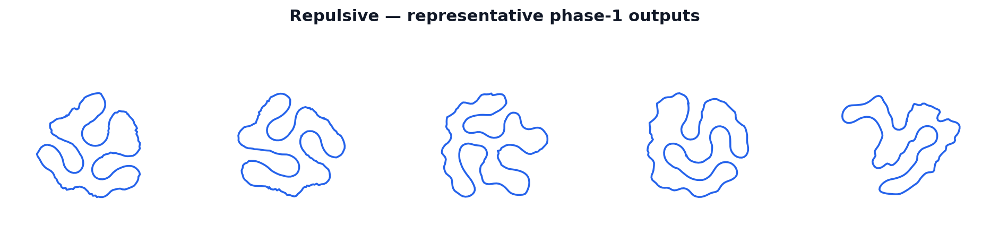

Repulsive Generator
====================

The ``repulsive`` generator grows each environment's closed centerline from a small seed
circle under a **hard ratcheting length constraint**, while a tangent-point (TP) energy
keeps the curve self-avoiding as it is confined to a disc domain seeded with per-env random
disc obstacles.  Growth runs coarse-to-fine (``N = 64 → 128 → 256``) with an area-based
stall-stop, then hands the grown loop to the unmodified standard tail (constant-spacing
resample → XPBD relax → inflate → validity).  The result is dense, paper-quality serpentine
circuits threading between the obstacles — a visibly different shape family from the other
five generators, all of which assemble a curve from a fixed set of sampled/steered control
points in a single deterministic pass.

The method follows Henrich and Kötter, *Generating Race Tracks With Repulsive Curves*
(IEEE, document 10645670), extended in the journal version *From Generation to Gameplay:
Authoring Race Tracks With Repulsive Curves* (IEEE Transactions on Games, 2025,
`doi:10.1109/TG.2025.3561107 <https://doi.org/10.1109/TG.2025.3561107>`__ — see
:doc:`/related-work/state-of-the-art` for a fuller discussion), which itself builds on
Yu, Schumacher, and Crane, *Repulsive Curves* (SIGGRAPH 2021 / arXiv 2020).

.. warning::

   ``repulsive`` is a **host-driven, non-graph-capturable optimizer** — it is the first
   registered generator that does not participate in CUDA-graph capture.  On an RTX 4090 it
   takes roughly **0.2 s at E=64** and **5 s at E=8192** (~3 ms/track amortized), versus
   ~2 ms per batch for ``bezier`` — **~1000× slower**.  It runs eagerly on CUDA every call
   (no captured replay); graph capture of the growth loop is future work (see
   `warp_generate_repulsive.py`'s module docstring and the design spike for why: a fresh
   ``wp.Tape`` is recorded every iteration for autodiff, which is illegal inside a capture
   region).  If you use ``repulsive`` in a training loop, prefer a **slow regeneration
   cadence** (regenerate a batch every N steps, not every step) or **staggered per-env
   slices** (regenerate a fraction of environments per step) rather than calling
   ``generate()`` every frame.

   Sample tracks produced by the ``repulsive`` generator across several seeds.

How It Works
------------

1. **Seed-driven obstacle layout.**
   ``_sample_obstacles_k`` draws, per environment, a domain-wall ring at radius ``r_dom``
   (``n_wall = 96`` points, weight 1.0) plus ``k ~ randi[repulsive_obstacle_count_min,
   repulsive_obstacle_count_max]`` inner-disc obstacle rings (``n_disc = 12`` points each,
   weight 0.25), one per ``2π/k`` angular wedge with a per-env random phase.  Each disc's
   radius is drawn from ``[repulsive_obstacle_radius_min_frac, repulsive_obstacle_radius_max_frac]
   · r_dom``, and its center radius from an analytic band that clears the seed circle by
   ``0.05·r_dom`` — no rejection loop, deterministic per ``(seed, env)``.

2. **Seed the target length and the initial circle.**
   A per-env target-perimeter multiplier ``grow_mult ~ U(repulsive_grow_mult_min,
   repulsive_grow_mult_max)`` sets ``L_final = grow_mult · 2π·r_init``.  ``_init_circle_k``
   writes the radius-``r_init`` circle into the coarsest stage's buffer prefix.

3. **Coarse-to-fine ratcheted growth.**
   Each iteration: the target length ``L_target`` ratchets toward ``L_final`` by
   ``repulsive_ratchet_rate``; a differentiable energy (tangent-point self-repulsion +
   inverse-power obstacle repulsion + a small length regularizer) is recorded under one
   ``wp.Tape`` and back-propagated to the curve; the gradient is preconditioned by a
   fractional-Sobolev filter (FFT-free — a precomputed circulant convolution) and projected
   to be orthogonal to the length direction; a normalized, barycenter-pinned step is applied;
   and the curve is hard-rescaled back to ``L_target``.  Growth starts at ``N=64`` and
   subdivides to 128 then 256 (arc-length resample) as the mean edge length doubles — the
   coarse start forces the ratcheted length into low-frequency folds rather than
   high-frequency wiggle.

4. **Deactivation + stall-stop.**
   Once an env's length reaches ``L_final``, its inner-disc obstacles are zeroed out (when
   ``repulsive_deactivate_obstacles``, the wall stays live) so the settle phase can close the
   halos left around each disc.  Every ``repulsive_stall_window`` iterations, an env freezes
   once it is past target length **and** its enclosed area (shoelace, reparameterization-
   invariant) has stopped changing by more than ``repulsive_stall_area_tol``; once every env
   is frozen the loop exits early.

5. **Hand off to the standard tail.**
   The final ``N=256`` closed loop is periodically arc-length reparameterized and copied into
   the shared ``out_centerline`` buffer with ``out_valid_wp = 1`` for every env — the same
   contract as every other generator.  The untouched pipeline (constant-spacing resample at
   ``0.6·half_width`` → XPBD relax → inflate → validity) then runs; feeding it a curve at the
   tail's calibrated spacing (rather than the raw ``N=256`` growth resolution) is what lifts
   post-tail yield to the target band.

Math
----

**Tangent-point energy** (dense, ``O(N²)`` pairs per env, constant ``±2`` circular
exclusion):

.. math::

   E_{\mathrm{TP}} = \sum_{i} \sum_{|i-j| \bmod N > 2}
       \frac{|w_{ij}|^{\alpha}}{(\lVert x_j - x_i \rVert^2 + \varepsilon^2)^{\beta/2}}\;
       w_i\, w_j,

where ``wᵢⱼ`` is the tangent-point wedge term (the signed distance of ``xⱼ`` from the
tangent line at ``xᵢ``), ``wᵢ``/``wⱼ`` are lumped-edge quadrature weights, and ``α =
repulsive_alpha``, ``β = repulsive_beta``.

**Obstacle energy** (inverse power ``p = β − α``):

.. math::

   E_{\mathrm{obs}} = \sum_i \sum_{m} m_w \cdot \lVert x_i - o_m \rVert^{-p},

summed over live obstacle-ring points ``o_m`` with mass/weight ``m_w`` (wall 1.0, inner
discs 0.25, zero once deactivated).

**Sobolev-preconditioned, length-orthogonal step.** The raw gradient ``g = ∇(E_TP + E_obs +
E_len)`` is preconditioned by the fractional-Sobolev inverse ``A⁻¹`` (a circular convolution
against a precomputed circulant row — the real-space form of ``1/(λₖˢ + ε)`` on the ring
Laplacian spectrum), then projected to remove the length-increasing component before a
normalized, barycenter-pinned step and a hard rescale back to the ratcheted target length —
the same TP-Sobolev flow as Yu/Schumacher/Crane, adapted with a **hard** length constraint
(ratchet + rescale) in place of their soft penalty, which the spike found necessary: the
obstacle-energy gradient outweighs a soft length penalty by 10³–10⁵×, so only a hard
constraint reliably grows the curve to target length.

Parameters
----------

The following ``TrackGenConfig`` fields are owned by the ``repulsive`` generator.  All other
fields (``num_points``, ``scale``, ``half_width``, etc.) are shared pipeline parameters
described in the configuration reference.

``repulsive_grow_mult_min`` / ``repulsive_grow_mult_max`` (default 4.5 / 5.5)
   Bounds of the per-env target-perimeter multiplier draw ``U(min, max)``; the grown loop's
   target perimeter is ``grow_mult · 2π·r_init``.  Higher → denser mazes at some yield cost.

``repulsive_domain_frac`` (default 0.35)
   Confinement-disc radius as a fraction of the world-scale reference length (``r_dom =
   repulsive_domain_frac · scale_ref · config.scale``).  Tighter → richer folds.

``repulsive_domain_init_ratio`` (default 4.0)
   Ratio ``r_dom / r_init`` of the domain radius to the initial seed-circle radius.

``repulsive_obstacle_count_min`` / ``repulsive_obstacle_count_max`` (default 8 / 12)
   Bounds of the per-env inner-disc obstacle count ``k ~ randi[min, max]`` (~9.9/env at
   defaults).

``repulsive_obstacle_radius_min_frac`` / ``repulsive_obstacle_radius_max_frac``
   (default 0.02 / 0.045)
   Inner-disc radius as a fraction of ``r_dom``.

``repulsive_ratchet_rate`` (default 0.012)
   Per-iteration length-growth factor of the hard ratchet.  ``<= 0.013`` holds full yield
   with folds; ``>= 0.016`` collapses the folds (a physical limit of fold formation, not a
   stall artifact).

``repulsive_alpha`` / ``repulsive_beta`` (default 3.0 / 6.0)
   Tangent-point energy exponents; the obstacle inverse power is ``p = beta - alpha``.

``repulsive_tau`` (default 0.4)
   Normalized flow step size.

``repulsive_w_len`` (default 30.0)
   Weight of the small inert length regularizer (the hard ratchet + rescale does the actual
   length enforcement; this is a live secondary nudge).

``repulsive_stages`` (default ``(64, 128, 256)``)
   Coarse-to-fine resolution schedule.  Must be non-empty, strictly increasing, each a
   positive multiple of 4, and its last entry must equal ``num_points``.

``repulsive_settle_iters`` (default 40)
   Settle-phase iteration budget above the ratchet.

``repulsive_resample_every`` (default 25)
   Periodic arc-length reparameterization interval (iterations).

``repulsive_stall_window`` (default 16)
   Iterations between stall checks / early-exit readbacks.

``repulsive_stall_area_tol`` (default 0.05)
   Freeze an env once it is past target length and its enclosed-area relative change over a
   stall window is below this tolerance.

``repulsive_deactivate_obstacles`` (default ``True``)
   Zero the inner-disc obstacle weights once an env reaches its target length (the wall
   stays live), closing the disc halos during the settle phase.

What Makes It Distinct
-----------------------

``repulsive`` is the only generator that constructs its output by **iterative physical
simulation** rather than a single deterministic sampling + smoothing pass, and consequently
the only one that is **not CUDA-graph-capturable** (``GeneratorSpec(capturable=False)``); see
:doc:`/how-it-works/cuda-graph` and :doc:`/contributing/writing-a-generator` for the capture
contract this opts out of.

Key contrasts:

- **Foldiest, most serpentine family (compactness ≈ 0.15).**  The ratcheted overfill forces
  the curve to buckle into dense multi-lobe circuits threading between the obstacles, well
  below the compactness of any of the other five generators.
- **Host-driven control flow.**  Stage transitions, per-window stall readbacks, and the
  global early exit are host-side Python, not static Warp launch topology — legal only
  because the generator is not captured.
- **~1000× slower.**  See the warning above; this is the dominant practical tradeoff against
  the shape richness.
- **Determinism caveat.**  CPU output is byte-identical per seed.  On CUDA, the growth is
  *statistically reproducible but not bit-identical* run-to-run: the ``wp.Tape`` gradient
  accumulates via atomics whose float summation order varies, and the flow is chaotically
  sensitive (a fold is a near-buckling instability) enough that this ~2e-6 noise compounds
  over ~200 iterations into a macroscopically different — but same-distribution, same-yield,
  same-compactness-band — track.  See the module docstring in
  ``track_gen/_src/warp_generate_repulsive.py`` for the full account.

Fallback and Validity
----------------------

``repulsive`` has no generator-local self-intersection fallback: it writes
``out_valid_wp = 1`` for every environment and relies entirely on the shared post-relax
inflation validity gate (turning number, thickness floor, no NaN, width floor).  A
self-crossing born during growth drives the local thickness toward zero, which the gate
catches downstream — no generator-side retry is needed.  In the spike's validated
configuration this yields 64/64 (100%) post-tail, with the XPBD tail doing modest polish
(opening sub-half-width pinches) rather than untangling gross tangles.
