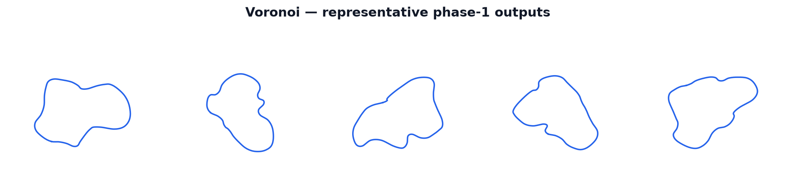

:orphan:

Voronoi Generator
=================

The ``voronoi`` generator produces compact, feature-rich closed centerlines by snapping a
cycle of angular anchor targets onto a randomly placed field of cell sites, rounding the
resulting polyline, and arc-resampling it into the standard pipeline buffer.  It is the
production distillation of the Voronoi / random-geometric prototype: the useful "right number
of cells" control is retained through the fixed site field, while exact Delaunay / Voronoi
ridge traversal and dynamic cycle extraction — which are incompatible with the fixed-shape
CUDA-graph contract — are replaced by a static angular-snap cycle that is allocation-free and
deterministic in ``(seed, config)``.  Of the five registered generators, ``voronoi`` yields the
highest typical compactness (~0.73) and effectively eliminates pre-relax self-intersections
without a generation retry loop.

   Sample tracks produced by the ``voronoi`` generator across several seeds.

How It Works
------------

1. **Draw the site field.**
   ``_sample_sites_k`` draws ``S = voronoi_num_sites`` points per environment using one of
   four ``voronoi_site_layout`` modes:

   - ``ring`` — uniform box fill.  Each site is drawn independently and uniformly within the
     full bounding box ``[-L/2, L/2]²`` (``L = box_size = 2.0``).  Despite its name, this
     mode does *not* produce an annular band; it is the flat, unstructured baseline.
     Source: ``_sample_sites_k``, lines 103–106 — the ``_LAYOUT_RING`` branch leaves
     ``use_annulus = 0`` and falls through to the uniform ``x, y`` draw.

   - ``void_ring`` (default) — area-uniform annular band with a center void.  Every site is
     placed in the annulus ``[0.14·L, 0.52·L]`` using the area-preserving radius formula
     ``r = sqrt(r_min² + rand·(r_max² - r_min²))``, leaving the center of the box empty.
     Source: ``_sample_sites_k``, lines 75–76 (``use_annulus = 1``) and 97–102 (annulus
     draw).

   - ``clustered`` — Gaussian-style clusters around six evenly spaced angular positions.
     Each point is assigned to a random cluster whose center lies at approximately
     ``0.24–0.34·L`` from the origin; points are scattered with noise radius
     ``~0.025–0.105·L``.  Roughly 22 % of clustered points are redirected to the annulus
     draw instead (source: ``_sample_sites_k``, line 90, ``wp.randf(state) < 0.22``).

   - ``mixed`` — blends the two placement modes per site: each site independently uses the
     annulus draw with probability 0.65 and the uniform box fill with probability 0.35
     (source: ``_sample_sites_k``, line 78, ``wp.randf(state) < 0.65``).

2. **Select anchor sites.**
   ``_select_anchor_sites_k`` draws ``K = voronoi_control_points`` angular sector targets.
   A global random rotation ``ρ`` is applied; sector ``i`` is centered at angle
   ``ρ + (2π/K)·i`` and jittered by ``εᵢ ∈ [-j, +j]`` where ``j = voronoi_angular_jitter``.
   Each target also has a radial component: a multi-harmonic profile ``φ(θ)`` (see Math
   section) modulates the target radius, scaled by ``voronoi_radial_variation``.  The anchor
   is then chosen as the site that minimises a combined angle + radius cost, with a large
   penalty (1 000) for already-used sites — an O(S) scan that keeps the selected cycle free
   of duplicate anchors.

3. **Chaikin subdivision.**
   ``_chaikin_once_k`` applies one round of Chaikin corner-cutting to the ``K`` selected
   anchors, converting each edge ``(pᵢ, pᵢ₊₁)`` into two new vertices at the 1/4 and 3/4
   points.  This doubles the polygon to ``AP = 2K`` augmented points and softens the raw
   anchor-snap polygon before spline evaluation.

4. **Closed Catmull-Rom spline.**
   ``_catmull_rom_dense_k`` evaluates a closed uniform Catmull-Rom spline over the ``AP``
   augmented vertices, producing a dense ``M = AP × num_points_per_segment``-point loop per
   environment.

5. **Arc-resample and normalize.**
   ``_arc_resample_inplace`` arc-resamples the dense loop to ``num_points`` uniformly spaced
   points.  ``_normalize_centerline_k`` then centers the environment's bounding box and
   isotropically rescales the longest dimension to ``scale × 1.44``, matching the shared
   target extent of the other generators.

6. **Fallback for self-crossing smooth loops.**
   ``self_intersections_inplace`` counts proper crossings on the ``num_points``-point loop.
   For environments where the smooth loop self-intersects, ``_assemble_polygon_selected_k``
   emits the straight Chaikin-augmented (``AP``-vertex) polygon by linear interpolation, and
   ``_arc_resample_selected_inplace`` overwrites those rows with an arc-resampled version of
   that polygon.  A second ``_normalize_centerline_k`` pass re-applies the bbox rescale.
   Non-crossing rows are left untouched.

Math
----

**Angular anchor targets.**
Anchor ``i`` has target angle

.. math::

   \theta_i = \rho + \frac{2\pi}{K}\,i + \varepsilon_i,
   \quad \varepsilon_i \sim \mathcal{U}(-j,\, j),
   \quad j = \texttt{voronoi\_angular\_jitter},

where ``ρ`` is a per-environment random offset drawn once and ``K = voronoi_control_points``.

**Radial variation profile.**
The target radius for anchor ``i`` is

.. math::

   r_i = \operatorname{clip}\!\Bigl(
       0.34\,L\,\bigl(1 + A\,\varphi(\theta_i)\bigr),\;
       0.16\,L,\; 0.52\,L
   \Bigr),

where ``L = box_size = 2.0``,

.. math::

   \varphi(\theta) = \frac{1}{1.5}\Bigl[
       0.62\sin(2\theta + \phi_0)
       + 0.44\cos(3\theta + \phi_1)
       + 0.26\sin(5\theta + \phi_2)
       + 0.18\cos(7\theta + \phi_3)
   \Bigr],

and the phase offsets ``φ₀, φ₁, φ₂, φ₃`` are independent per-environment random angles.
The amplitude is clamped:

.. math::

   A = \operatorname{clip}(\texttt{voronoi\_radial\_variation} \times b,\; 0,\; 0.85),

with layout boost ``b = 1.10`` for ``void_ring``, ``1.16`` for ``clustered``, ``1.06`` for
``mixed``, and ``1.00`` for ``ring``.

**Anchor snap cost.**
The nearest-unused-site snap minimises

.. math::

   c(s) = \frac{|\Delta\theta_s|}{\sigma}
          + \frac{|r_s - r_i|}{0.13\,L}
          + 1000\cdot\mathbb{1}[\text{used}(s)],
   \quad \sigma = \frac{2\pi}{K},

over all ``S`` sites, where ``Δθₛ`` is the signed angular difference between site ``s`` and
the target angle (wrapped to ``(-π, π]``).

**Chaikin corner-cutting.**
Each edge ``(pᵢ, pᵢ₊₁)`` of the ``K``-anchor polygon is replaced by two vertices:

.. math::

   q_{2i}   = \tfrac{3}{4}\,p_i + \tfrac{1}{4}\,p_{i+1}, \qquad
   q_{2i+1} = \tfrac{1}{4}\,p_i + \tfrac{3}{4}\,p_{i+1},

producing the ``AP = 2K`` augmented vertices.

**Closed uniform Catmull-Rom.**
The dense loop is evaluated as

.. math::

   P(t) = \tfrac{1}{2}
   \begin{bmatrix} 1 & t & t^2 & t^3 \end{bmatrix}
   \begin{bmatrix}
    0 &  2 &  0 &  0 \\
   -1 &  0 &  1 &  0 \\
    2 & -5 &  4 & -1 \\
   -1 &  3 & -3 &  1
   \end{bmatrix}
   \begin{bmatrix} P_{i-1} \\ P_i \\ P_{i+1} \\ P_{i+2} \end{bmatrix},

where indices wrap modulo ``AP``.

Parameters
----------

The following ``TrackGenConfig`` fields are owned by the ``voronoi`` generator.  All other
fields (``num_points``, ``num_points_per_segment``, ``scale``, ``half_width``, etc.) are
shared pipeline parameters described in the configuration reference.

``voronoi_num_sites`` (``S``, default 256)
   Number of cell sites drawn per environment.  Higher values make the anchor-snap richer
   and improve coverage of the site field, but scale the per-anchor O(S) cost scan linearly.

``voronoi_site_layout`` (default ``"void_ring"``)
   Spatial distribution of sites.  One of ``"ring"`` (uniform box fill),
   ``"void_ring"`` (annular band with a center void), ``"clustered"`` (six Gaussian-style
   clusters), or ``"mixed"`` (65 % annulus / 35 % uniform, per site).  The layout also
   adjusts the amplitude boost applied to ``voronoi_radial_variation``.

``voronoi_control_points`` (``K``, default 18)
   Number of angular anchors selected from the site field.  More anchors add local features
   and tighter curvature, but also increase the smoothing and relaxation burden.

``voronoi_radial_variation`` (default 0.62)
   Amplitude of the per-anchor radius modulation.  At 0 all anchor targets sit at the same
   base radius (0.34·L); at larger values the multi-harmonic profile drives anchors to vary
   between 0.16·L and 0.52·L, producing more irregular, non-circular layouts.

``voronoi_angular_jitter`` (default 0.08)
   Maximum angular perturbation (in radians) applied to each sector target.  Small values
   keep anchors close to their ideal evenly-spaced sectors; larger values break the rotational
   regularity.

What Makes It Distinct
----------------------

``voronoi`` is the only generator built around a pre-placed site field.  The angular-snap
construction produces tracks anchored to a concrete spatial texture rather than drawn from
pure random Cartesian or polar coordinates, which gives the family a characteristic
"cell-like" compactness absent from the other four generators.

Key contrasts:

- **Highest compactness (~0.73).**  The ``void_ring`` default biases sites into an annular
  band and selects anchors around the full perimeter, consistently producing compact,
  looping layouts with high area-to-perimeter ratios.

- **Zero pre-relax self-intersections in practice.**  The site field and the annular bias of
  the default layout keep anchors at meaningful separations.  The Chaikin + Catmull-Rom
  smoothing pass almost never produces a self-crossing loop, so the polygon fallback
  path is rarely triggered.

- **Multi-scale control.**  ``voronoi_num_sites`` controls global cell density; ``voronoi_control_points``
  controls route complexity; ``voronoi_radial_variation`` and ``voronoi_angular_jitter``
  control irregularity within the route.  No other generator exposes a site-density knob
  independent of its curve-complexity knob.

- **No style-sampling.** Unlike ``bezier``, the Voronoi generator does not support
  per-environment parameter sampling from a range; its randomness comes entirely from the
  seed-driven site draw and anchor selection.

Fallback and Validity
---------------------

If the Chaikin-smoothed Catmull-Rom loop for an environment self-intersects after
arc-resampling, the generator falls back to the corresponding Chaikin-augmented
``AP``-vertex straight polygon, arc-resampled via ``_arc_resample_selected_inplace``.  Only
the crossing rows are overwritten; non-crossing rows are untouched.  Both the smooth-loop
and polygon-fallback paths write ``out_valid_wp = 1`` for every environment.

Final geometric validity — turning number close to 2π, minimum track thickness, absence of
NaNs, and width floor — is decided after the shared resample → XPBD relax → inflate
pipeline, not by the generator itself.  The XPBD relaxation pass will re-round the
flat-polygon fallback into a smoother loop, just as it does for the ``bezier`` and ``hull``
fallback paths.
