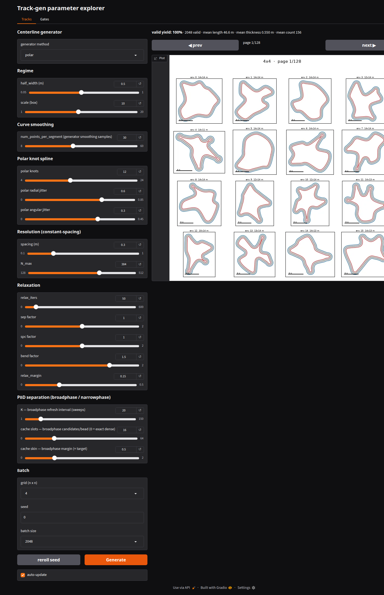

Parameter explorer (UI)
=======================

An interactive Gradio app to see how each parameter affects generation — sliders for the
regime / shape / resolution / relaxation knobs, a live track grid, and the valid-yield stat.

   The **Tracks** tab: generator / regime / shape / resolution / relaxation controls on the
   left, a paged grid of freshly generated tracks on the right, and the valid-yield +
   mean-length / thickness / count stat line computed over the whole batch.

Launching
---------

.. code-block:: bash

   uv pip install -e ".[ui]"     # adds gradio
   uv run python -m viz.param_explorer   # opens a local URL (default http://127.0.0.1:7860)

Controls
--------

Controls are grouped:

- **Centerline generator** — method selector.
- **Regime** — width / box.
- **Shape** — corner count / ``rad`` / ``edgy`` / ``handle_clamp_frac``.
- **Polar knot spline**.
- **Voronoi graph cycle** — ``voronoi_num_sites``, layout, control points, variation.
- **Checkpoint steering** — ``checkpoint_count``, turn/steer/lookahead, best-of-K, clip fallback.
- **Resolution** — ``spacing`` / ``N_max``.
- **Relaxation**.
- **Batch**.

Output is always ``constant_spacing`` (the only mode): **``spacing``** sets the arc step
(≈ ``0.6*half_width``) and **``N_max``** the per-track point cap. **``handle_clamp_frac``**
trades Bézier-handle overshoot (the main self-crossing source) against corner roundness.

**Batch size** generates that many tracks (256–8192); the **valid-yield % + mean length /
thickness / count** shown above the grid are computed over the *whole batch* for honest
stats.

The grid shows one **page** of ``grid_n × grid_n`` tracks — **◀ prev / next ▶** pages
through the batch *without* regenerating. Invalid tracks get a red title.

**Auto-update** (on) re-generates as you change a control; for heavy settings (large batch ×
high ``relax_iters``) untick it and use **Generate**. **Reroll** draws fresh seeds.

Gates tab
---------

A second tab generates gate sequences instead of tracks. Controls are grouped:

- **Gate generator** — method selector and ``ordering`` (choices follow the selected generator).
- **Gate layout** — ``gate_width`` (full gate opening) and ``scale`` (pre-collision layout size).
- **Gate collisions** — ``gate_radius``, ``gate_solve_iters``, and **show raw anchors** (forces
  ``gate_solve_iters=0`` to inspect anchors before the collision solve). Center spacing target is
  ``2 * gate_radius``.
- **Generator-specific sampling** — point-family (Bezier/Hull), Polar, Voronoi, or Checkpoint
  controls, shown for the selected generator.
- **Batch** — grid (n×n), seed, batch size; the stat line reports valid-yield and gate counts
  over the whole batch, and **◀ prev / next ▶** pages through the batch without regenerating.
