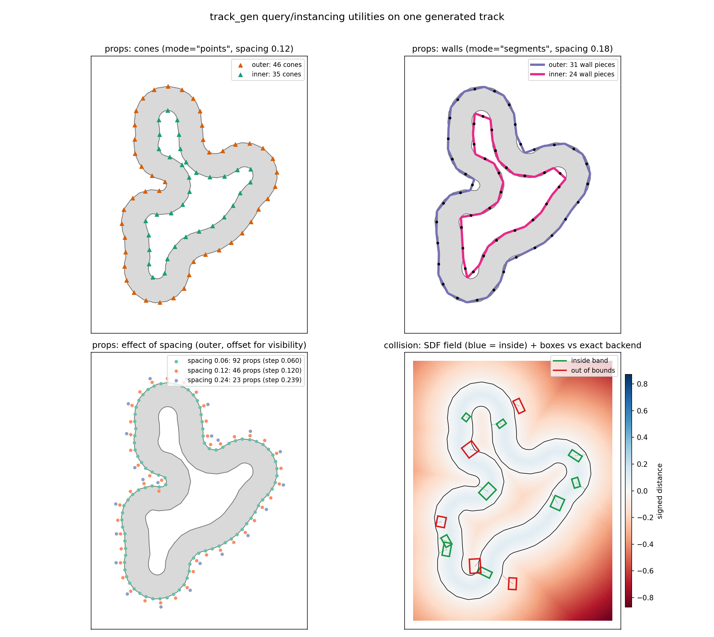

API reference
=============

Runtime facades
---------------

.. autoclass:: track_gen.TrackGenerator
   :members:

.. autoclass:: track_gen.GateGenerator
   :members:

Seeded RNG
----------

.. autoclass:: track_gen.PerEnvSeededRNG
   :members:

Result types
------------

.. autoclass:: track_gen.Track
   :no-members:

   .. automethod:: clone

.. autoclass:: track_gen.GateSequence
   :no-members:

   .. automethod:: clone

Collision queries
-----------------

Box-vs-track out-of-bounds checks with full contact info. See
``track_gen.collision`` for backend trade-offs (exact ``segments`` scan vs
baked ``sdf`` grids).

         the collision SDF field with boxes classified by the exact backend.

   The query/instancing utilities on one generated track: ``track_gen.props``
   cones (points mode) and wall pieces (segments mode) on both boundaries,
   the effect of the spacing knob, and ``track_gen.collision``'s baked SDF
   field with boxes classified by the exact segments backend (green inside,
   red out of bounds, dotted lines to the nearest boundary point).
   Regenerate with ``python -m viz.render_utility_assets``.

.. automodule:: track_gen.collision
   :no-members:

.. autoclass:: track_gen.collision.CollisionChecker
   :members:

.. autoclass:: track_gen.collision.BoxContact
   :no-members:

   .. automethod:: clone

.. autoclass:: track_gen.collision.DiscChecker
   :members:

.. autoclass:: track_gen.collision.DiscContact
   :no-members:

   .. automethod:: clone

Performance
~~~~~~~~~~~

Measured with ``benchmarks/benchmark_collision.py`` on an RTX 4090
(warp-lang 1.14, E = 8192 generated tracks × 8 boxes = 65,536 box queries
per call, default ``TrackGenConfig``):

.. list-table::
   :header-rows: 1
   :widths: 22 20 20 38

   * - backend
     - eager / query
     - graph replay / query
     - precompute per regeneration
   * - ``segments`` (exact)
     - ~0.32 ms
     - ~0.29 ms
     - none
   * - ``sdf`` (128² grids)
     - ~0.053 ms
     - ~0.025 ms
     - ~49 ms ``bake()`` + ~670 MB

Accuracy of ``sdf`` against the exact backend on the same workload: the
signed-distance error is typically ~2% of a grid cell (p99 < 0.4 cells);
OOB flags agree on 99.6% of boxes, disagreeing only inside the ±1-cell band
around zero clearance. SDF normals are noisy near the middle of the band
(medial axis) and at sharp features — prefer ``segments`` when normals or
nearest points drive a contact response.

Rule of thumb: ``segments`` is the default — exact, no memory, no rebake,
and already ~5 ns per box. Switch to ``sdf`` when a track batch serves more
than roughly 200 queries between regenerations and only the OOB flag and
approximate clearance are consumed (e.g. RL reward shaping).

Reproduce::

   python -m benchmarks.benchmark_collision --E 8192

Boundary props
--------------

Rendering-only instancing poses along track boundaries — cone lines
(``mode="points"``) and wall pieces (``mode="segments"``). Complementary to
the collision utility: props never collide. Results for invalid envs
(``Track.valid == 0``) are undefined — always gate on ``valid``.

.. automodule:: track_gen.props
   :no-members:

.. autoclass:: track_gen.props.PropSampler
   :members:

.. autoclass:: track_gen.props.PropSet
   :no-members:

   .. automethod:: clone

Checkpoints
-----------

Ordered course goals from gates (zero-copy) or subsampled track centerlines.

.. automodule:: track_gen.checkpoints
   :no-members:

.. autoclass:: track_gen.checkpoints.CheckpointSampler
   :members:

.. autoclass:: track_gen.checkpoints.CheckpointSet
   :no-members:

   .. automethod:: from_gates

   .. automethod:: clone

Progress tracking
-----------------

Stateful per-env course progress over any ``CheckpointSet``.

.. autoclass:: track_gen.progress.ProgressTracker
   :members:

.. autoclass:: track_gen.progress.ProgressEvents
   :no-members:

   .. automethod:: clone
