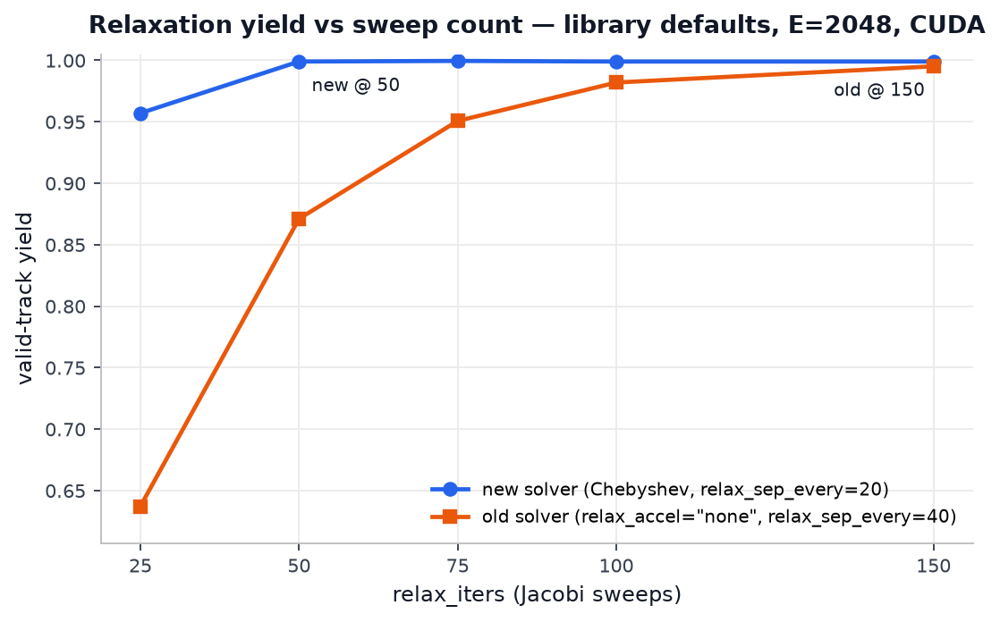
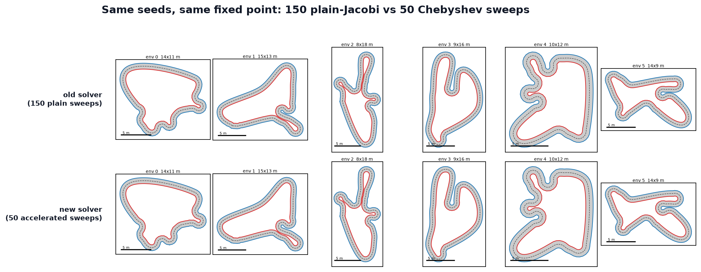

Relaxation — convergence and tuning
===================================

This page covers how the solve converges, what the Chebyshev acceleration buys (with
measured numbers), the ``relax_sep_every`` pitfall, and tuning guidance including the
dead ends that were measured so you don't have to retry them.

Why plain Jacobi needed ~150 sweeps
-----------------------------------

Three effects compound to make the plain solve slow:

1. **Diffusive propagation.** Every constraint is local (a bead and its neighbours, or
   one bead pair), so corrections propagate along the chain roughly one bead per sweep —
   diffusively. A deep initial penetration between two arcs needs a *long-range* shape
   change (whole arcs must migrate apart), and plain Jacobi delivers that change at
   diffusion speed.
2. **Deep initial penetrations.** Raw first-stage centerlines can start far inside the
   separation target, so the total displacement to resolve is many multiples of the
   per-sweep correction.
3. **The hairpin force balance.** Near tight hairpins, separation (pushing beads apart),
   bending (rounding the apex), and spacing (keeping edge lengths) settle into a
   slowly-tightening force balance rather than a clean fixed point — each sweep makes a
   small net gain against the others, and convergence is asymptotic.

.. raw:: html

   <video controls loop muted playsinline width="100%" poster="../_static/relaxation-iterations-poster.png">
     <source src="../_static/relaxation-iterations.mp4" type="video/mp4">
   </video>

Four tracks whose raw constant-spacing centerlines are deeply self-overlapping, evolving
from the raw frame (``relax_enable=False``) through the pure iterative solve
(``sweep k / 50``, smoothing tail off) and then through the post-solve smoothing tail
(``pass p / 5``). Because the solve is a fixed, deterministic launch sequence, each frame
is generated afresh with ``relax_iters=k`` and is a *true* snapshot of the same
trajectory (the raw centerlines are asserted bit-identical across two generations). Watch
the deep initial penetrations migrate apart diffusively — a whole-arc shape change that
plain Jacobi delivers only one bead per sweep, which is exactly why the plain solve
needed so many. Regenerate with ``python -m viz.render_relaxation_video`` (needs ffmpeg).

Chebyshev acceleration (see :doc:`solver`) attacks exactly the first and third effects:
it extrapolates along the low-frequency, long-wavelength modes that diffusion is slow
on.

What acceleration buys — measured
---------------------------------

All numbers below are E=4096 fixed seeds on CUDA. Two regimes: **defaults** is the
library default config; **hard** is the benchmark regime ``half_width=0.5``,
``scale=10``, ``spacing=0.30``.

Yield vs sweep count, old solver (plain Jacobi, ``relax_accel="none"``,
``relax_sep_every=40``):

.. list-table::
   :header-rows: 1

   * - Sweeps
     - 25
     - 50
     - 75
     - 100
     - 150
   * - hard
     - 0.878
     - 0.970
     - 0.987
     - 0.994
     - 0.997
   * - defaults
     - 0.627
     - 0.871
     - 0.951
     - 0.978
     - 0.993

Yield vs sweep count, new solver (Chebyshev, ``relax_sep_every=20``):

.. list-table::
   :header-rows: 1

   * - Sweeps
     - 25
     - 40
     - 50
     - 150
   * - hard
     - 0.988
     - 0.999
     - 0.9995
     - 1.000
   * - defaults
     - 0.958
     - 0.996
     - 0.999
     - 0.999

   Measured yield vs sweep count in the defaults regime (E=2048, CUDA): the new
   Chebyshev solver at 50 sweeps clears what the old plain-Jacobi solver needed 150 for.

Quality at the new 50-sweep operating point — which now includes the post-solve
smoothing tail (see :doc:`solver`) — matches or beats the old 150-sweep point on
spacing, smoothness, and minimum radius. The smoothing tail trades a hair of gate margin
(still comfortably above the ``1.0 · hw`` gate) for markedly lower curvature noise
(defaults regime):

.. list-table::
   :header-rows: 1

   * - Metric
     - New @ 50
     - Old @ 150
   * - Spacing RMS
     - 0.0049
     - 0.0086
   * - Curvature-difference smoothness
     - 0.169
     - 0.251
   * - Min Menger radius
     - 1.35 · hw
     - 1.16 · hw
   * - Gate-margin 5th percentile
     - 1.01 · hw
     - 1.03 · hw

Warmed wall-clock per ``generate()`` call at E=4096: defaults **15.9 → 10.5 ms**, hard
**53.5 → 19.5 ms**.

Confirmed on a disjoint seed batch (seed 100000): new@50 = **0.9990 / 0.9990** vs
old@150 = **0.9973 / 0.9924** (hard / defaults).

   Identical seeds through the old solver at 150 sweeps (top) and the new solver at 50
   (bottom), in the benchmark regime. The accelerated solve converges to the same fixed
   point — the tracks are visually indistinguishable.

The ``relax_sep_every`` pitfall
-------------------------------

In the cached separation mode, the broadphase candidate cache is built at sweep 0 and
refreshed only at multiples of ``relax_sep_every``. **Any run shorter than that never
refreshes the cache mid-solve** and silently misses contacts that emerge during the run
— beads that were outside the broadphase radius at sweep 0 can drift into contact and
never receive a separation push. Under the old default of 40 this produced a measured
yield cliff between 40 and 50 sweeps: a 40-sweep run got exactly one broadphase build
(at sweep 0), a 50-sweep run got a refresh at sweep 40. The default is now
``relax_sep_every=20`` so the accelerated 50-sweep solve refreshes mid-solve (at sweeps
20 and 40). If you shorten ``relax_iters``, keep ``relax_sep_every`` comfortably below
it.

Tuning guidance
---------------

- **Raise** ``relax_iters`` **first** if yield sags. Cost is linear in sweeps and it does
  not restrict shapes. The current default of 50 is calibrated for ~0.999 end-to-end
  yield at the library defaults.
- **Don't push the Chebyshev knobs.** ``relax_cheby_rho >= 0.99`` and
  ``relax_cheby_start <= 5`` were both measured to overshoot on the nonsmooth separation
  contacts and *reduce* yield. ``relax_cheby_gamma`` below ~0.9 over-damps and gives
  back the acceleration. The defaults (rho 0.98, gamma 0.9, start 8) are the measured
  operating point.
- Keep ``relax_sep_every`` well below ``relax_iters`` (see the pitfall above).
- **Tune the smoothing tail with** ``relax_smooth_passes`` **(default 5) and**
  ``relax_smooth_spacing_iters`` **(default 10).** The Taubin passes remove the
  sub-``R_min`` curvature noise the bending guard's deadband cannot see; the spacing
  polish restores bead uniformity afterwards. In the prototype (512 tracks) the default
  tail cut curvature-difference RMS ~33% on average (~51% on the worst track) with zero
  validity loss and *improved* spacing RMS. Set both to 0 to disable the tail entirely.
  Raising ``relax_smooth_passes`` smooths harder but eats into the gate margin — the
  Taubin passes are shrink-free but not curvature-preserving, so watch
  ``thickness_rel_p05``.

Measured dead ends
------------------

The following were tried and measured to be worse. They are recorded here so future
tuners do not retry them.

- **Constant over-relaxation / SOR.** A constant position-level omega of 1.3–1.5, or
  ``relax_sep_relax`` / ``relax_spc_relax`` >= 1.5, collapses yield to **0.31–0.75**.
  Separation contacts switch on and off between sweeps, and constant over-relaxation
  amplifies exactly that switching noise. Chebyshev's *decaying* omega schedule combined
  with the gamma under-relaxation is the stable variant of the same idea.
- **Raising** ``relax_margin``. It buys yield but costs **20–40% spacing-RMS quality** —
  the larger target distorts the bead chain everywhere, not just at contacts. Prefer
  more sweeps.
- **Bend-relax decay schedules.** Ramping ``relax_bend_relax`` down over the solve never
  beat the constant default of 1.5 at short sweep budgets.
- **Weakening the gate coupling** — widening the exclusion band or capping near-band
  pair targets at the chord-feasible distance — collapses yield (defaults-regime
  0.99 → 0.74 at band+1). See :ref:`relax-gate-coupling` for the full account.
- **Plain (non-Taubin) Laplacian smoothing** in the post-solve tail. A plain Laplacian
  (``x += lambda * L(x)`` with no compensating negative half-step) shrinks the curve —
  it pulls corners inward, and in the prototype 10 plain-Laplacian passes collapsed yield
  to **0.12** by dragging corners back through the thickness gate. The Taubin two-step
  (``mu < -lambda``) is the shrink-free variant that is actually shipped; do not swap it
  for a plain Laplacian.
