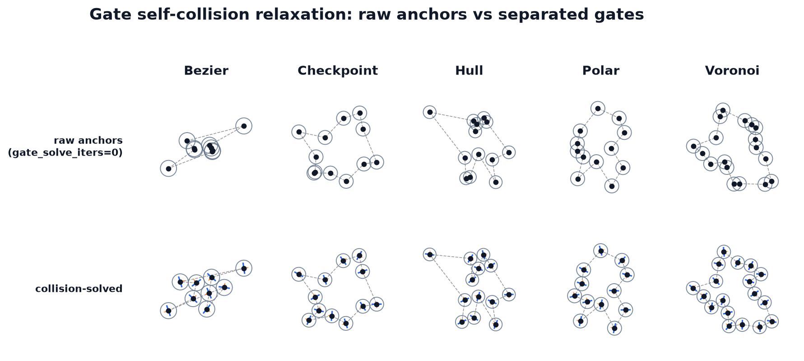

Gate relaxation — collision solve
=================================

Drone-style gate sequences (``GateGenerator``, tutorial at
:doc:`/tutorials/gate-sequences`) run their own **gate self-collision relaxation**, separate
from the XPBD track relaxation documented on the other pages in this section. It is a
small per-env pairwise separation that pushes overlapping gates apart before tangents
and frames are computed. This page covers why it exists, the sphere model and its
target distance, the Gauss-Seidel solve semantics, its determinism, the one knob that
controls it, and how it behaves under CUDA-graph capture.

Why gates need it
-----------------

The gate path does **not** run resample, XPBD relaxation, or inflation — it emits the
centerline-generator corner anchors directly as gate centres. Raw anchors routinely land close
together or exactly coincident (two sampled anchors in the same grid cell, a
tight-corner cluster). Without separation the resulting sequence has gates overlapping
in the plane: unusable as a drone course, and — with a positive ``gate_width`` — prone
to crossing gate bars that fail the validity check. The collision solve spreads
overlapping gates to a minimum centre spacing so the sequence is a clean, traversable
course.

   Gate self-collision relaxation: raw anchors (top, ``gate_solve_iters=0``) versus
   the separated gates (bottom), with gate tangents and ``gate_width`` bars.

The sphere model and target distance
------------------------------------

Each gate centre is treated as a disk (a 2-D sphere) of radius ``gate_radius``. Two
gates overlap when their centres are closer than the sum of the two radii, so the
target centre-to-centre distance is twice the radius. ``_gate_center_distance`` derives
it from a single config field:

.. math::

   d_{\text{target}} = 2 \cdot \text{gate\_radius},

so at the default ``gate_radius = 0.025`` the target centre spacing is ``0.05`` in
normalized track coordinates. ``gate_radius`` is the only config field that feeds the
target; ``gate_width`` is a separate visual/collision half-width for the gate bar and
does **not** enter the separation target.

Where it runs in the pipeline
------------------------------

The solve is invoked from ``_run_gate_pipeline`` in ``track_gen/_src/warp_gate.py``,
after the generator has produced ordered, normalized anchors and before frames and
validity. Every native gate generator (``bezier``, ``hull``, ``polar``, ``voronoi``,
``checkpoint``) routes through this one path, so the stage order is uniform:

.. code-block:: text

   raw anchors → ordering (ccw / raw / random_pairs) → bbox normalization
       → SPHERE RELAXATION → recompute tangents → frames + validity

Concretely, ``_run_gate_pipeline`` calls ``relax_gate_spheres`` only when
``gate_solve_iters > 0`` and the target distance is positive, then recomputes tangents
from the moved positions (``tangents_from_positions``) before ``finalize_gate_sequence``
writes the normals, endpoints, and per-sequence validity. Because separation can push
gates outward, the final bounding box may expand beyond the normalized extent to satisfy
the requested spacing.

The solve: per-env sequential Gauss-Seidel
------------------------------------------

``relax_gate_spheres`` launches ``_relax_gate_spheres_k`` with **one thread per env**
(``dim = E``). Each thread owns one gate sequence and runs the whole separation loop
in-kernel:

- For up to ``iterations`` rounds, it scans every ordered gate pair :math:`(i, j)`,
  :math:`j > i`, over the env's real gate ``count``.
- A pair with centre distance ``dist < target_distance`` is pushed apart
  **symmetrically** by half the deficit each:

  .. math::

     \text{correction} = \tfrac{1}{2}\,(d_{\text{target}} - \text{dist})\,\hat{n},
     \qquad p_i \mathrel{-}= \text{correction},\quad p_j \mathrel{+}= \text{correction},

  where :math:`\hat{n}` is the unit vector from :math:`p_i` to :math:`p_j`.
- Positions are written back **in place** inside the pair loop, so later pairs in the
  same round already see the corrections applied by earlier pairs. That is
  **Gauss-Seidel** iteration, unlike the track solver's Jacobi double-buffering.
- Each round tracks whether any pair moved; a round that moves nothing triggers an
  **early exit** from the iteration loop (the sequence is already separated).

.. raw:: html

   <video controls loop muted playsinline width="100%" poster="../_static/relaxation-gates-iterations-poster.png">
     <source src="../_static/relaxation-gates-iterations.mp4" type="video/mp4">
   </video>

Five bezier gate sequences whose raw anchors (``gate_solve_iters=0``) are heavily
overlapping (10-15 pairs inside the separation target each), evolving round by round
through the Gauss-Seidel sphere separation at an illustrative ``gate_radius=0.13``
(target spacing ``0.26``; the default radius is ``0.025``) with ``gate_width=0.16``
bars. Because the coincident-pair tie-break is indexed by the **round** index — not the
total budget — a run with ``gate_solve_iters=k`` executes exactly the first ``k`` rounds
of a longer run, so each frame is generated afresh at budget ``k`` and is a *true*
snapshot of the same trajectory (the raw anchors are asserted bit-identical across two
generations). Each panel gains a ``converged`` tag once its state stops changing — the
per-env early exit in action; the round budget only bounds the loop. Regenerate with
``python -m viz.render_relaxation_video --gates`` (needs ffmpeg).

Contrast with the track XPBD solver
~~~~~~~~~~~~~~~~~~~~~~~~~~~~~~~~~~~~~

The track solver (see :doc:`solver`) is deliberately the opposite design:

.. list-table::
   :header-rows: 1

   * -
     - Track relaxation
     - Gate relaxation
   * - Parallelism
     - E-wide, **thread-per-bead** (``E * N_max`` threads)
     - **thread-per-env** (``E`` threads), pairs looped in-kernel
   * - Update order
     - **Jacobi** — reads previous-sweep buffer, double-buffered
     - **Gauss-Seidel** — in-place, later pairs see earlier moves
   * - Loop structure
     - Fixed sweep count, one kernel launch per sweep
     - Single launch; rounds and pairs looped inside the kernel
   * - Termination
     - Fixed iteration budget
     - **Early exit** when a round moves nothing

Why the flip is the right trade-off: a track carries hundreds of beads
(:math:`N_\text{max}`), so parallelizing across beads is what keeps the sweep cheap, and
Jacobi double-buffering is what makes that bead-parallel update order-independent and
graph-capturable. A gate sequence carries only **dozens** of gates (default
``max_gates = 32``), so the :math:`O(G^2)` pair loop is tiny (a few hundred to a thousand
comparisons per round) and there is no need to parallelize across gates — one thread per
env already saturates the batch dimension ``E``. Running the whole solve inside a single
thread means Gauss-Seidel updates in place with **no double-buffering**, and the early
exit is **free** (a per-thread ``break``) rather than a host-side sync that would break
graph capture.

Determinism: the coincident-gate tie-break
-------------------------------------------

When two gates are **exactly coincident** (``dist`` at or below ``1e-8``) there is no
well-defined separation direction. The kernel synthesizes a deterministic pseudo-random
one from an angle hash of the pair and iteration indices:

.. math::

   \theta = 12.9898\,(i{+}1) + 78.233\,(j{+}1) + 37.719\,(\text{it}{+}1)
            + 19.371\,(e{+}1),
   \qquad \hat{n} = (\cos\theta,\ \sin\theta).

The hash depends only on the gate indices ``(i, j)``, the round ``it``, and the env
``e`` — no RNG state — so the separation is **bit-for-bit reproducible** across runs and
across CUDA-graph replays. Distinct coincident pairs and successive rounds get distinct
directions, so a cluster of stacked gates fans out rather than collapsing along one axis.

The ``gate_solve_iters`` knob
-----------------------------

The iteration budget is ``GateGenConfig.gate_solve_iters`` (default ``8``, validated
``>= 0``). It is the ``iterations`` upper bound on the round loop; the early exit means
well-separated sequences finish in fewer rounds. **Setting ``gate_solve_iters = 0``
disables the solve entirely** — ``relax_gate_spheres`` returns immediately, and the gate
generators skip both the separation launch and the tangent recompute. That is the mode
to use when inspecting the raw ordered, normalized anchors before separation (close gates
may still overlap). The target distance is governed separately by ``gate_radius``;
``gate_radius = 0`` also short-circuits the solve.

Graph capture and zero-alloc
----------------------------

The solve is a single ``wp.launch`` of a fixed-shape kernel: the launch dimension
(``E``) and the ``iterations`` bound come from the config, not from data, so the launch
sequence is data-independent and captures cleanly into the gate pipeline's ``wp.Graph``.
The in-kernel early-exit ``break`` is per-thread control flow **inside** the kernel — it
does not vary the host launch sequence, so it is compatible with capture. As elsewhere in
``warp_gate.py``, ``_sync`` is a no-op while ``_CAPTURING`` is set, so no host
synchronization is issued during capture. The separation runs in place on the existing
``position`` buffer with no per-call allocation.

See also
--------

- :doc:`/tutorials/gate-sequences` — the end-to-end gate-generation recipe and output
  fields, including the runtime section that drives gates for RL.
- :doc:`/utilities/course` — the runtime side: ``Course`` in gates mode turns these
  separated gates into checkpoints and optional gate-post collision.
- :doc:`overview`, :doc:`solver` — the XPBD **track** relaxation stage this solve is
  deliberately contrasted with.
