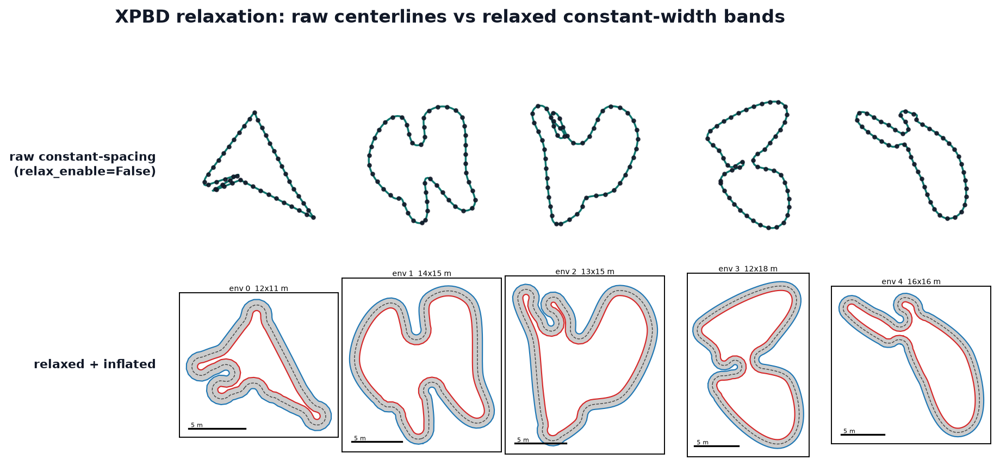

Track relaxation — overview
===========================

Relaxation is the **second stage** of the runtime pipeline. It sits between the
constant-spacing resample and the constant-width inflation:

.. code-block:: text

   generate → constant-spacing resample → RELAXATION → inflate

A raw constant-spacing centerline is not yet inflatable. The first-stage generators
produce closed loops that self-approach (two distant arcs of the loop passing close in
the plane) and that contain under-radius corners tighter than the road half-width. If
such a centerline were inflated directly into a constant-width band, the band would
overlap itself or pinch to zero at the tight corner, and the track would fail the
downstream thickness gate. Relaxation reshapes the bead chain — opening self-approaches
and rounding tight corners — so that a constant-width inflation of it succeeds.

   Top row: raw constant-spacing centerlines (``relax_enable=False``), drawn as
   centerlines only. Bottom row: the same seeds after relaxation and inflation into a
   constant-width band. Relaxation is what makes the bottom row inflatable.

Why it is needed
----------------

Validity is decided **after** relaxation, by the inflation stage's thickness gate. A
track is thickness-valid when

.. math::

   \min(r_{\min},\ \tfrac{1}{2}\,\text{sep}_{\min})
   \ \ge\ (1 - \text{relax\_tol})\cdot \text{half\_width},

where :math:`r_{\min}` is the smallest local (Menger) radius of curvature,
:math:`\text{sep}_{\min}` is the smallest non-adjacent bead-pair distance, and
``relax_tol`` = 0.02. The half of ``sep_min`` is the load-bearing quantity: two arcs a
distance :math:`d` apart can only host two half-width roads without overlap if
:math:`d \ge 2\cdot\text{half\_width}`. A raw centerline routinely violates both terms;
relaxation exists to satisfy them with margin to spare.

Because the gate is applied post-relax, relaxation is the single stage that determines
end-to-end yield. At the library defaults the current solver reaches **~0.999**
relaxed-valid yield.

What changed
------------

The relaxation solve was recently accelerated. The default is now **50
Chebyshev-accelerated Jacobi sweeps** (``relax_iters=50``, ``relax_accel="chebyshev"``),
replacing the previous **150 plain-Jacobi sweeps**. The accelerated solve reaches
equal-or-higher yield and equal-or-better quality in a third of the sweeps, and roughly
half the wall-clock — see :doc:`convergence` for the measured tables. A short
**post-solve smoothing tail** (shrink-free Taubin passes plus spacing polish,
``relax_smooth_passes`` / ``relax_smooth_spacing_iters``) then strips the fine curvature
noise the constraints' deadband leaves behind, cutting curvature-difference RMS by ~a
third with no validity loss.

The four pages
--------------

- :doc:`constraints` — the solver setup (rest length, separation band, targets) and the
  three per-sweep corrections (separation, spacing, bending), plus the **gate coupling**:
  why the separation target deliberately overshoots the validity gate's floor, and why
  weakening that overshoot was measured to collapse yield.
- :doc:`solver` — how the solve executes: Jacobi double-buffering, the dense and cached
  separation execution modes, and the **Chebyshev semi-iterative acceleration** that is
  the substance of the recent update.
- :doc:`convergence` — convergence behaviour and tuning: why plain Jacobi needed ~150
  sweeps, what acceleration buys (with measured yield/quality/timing tables), the
  ``relax_sep_every`` short-run pitfall, tuning guidance, and a list of measured dead
  ends.

The implementation lives in ``track_gen/_src/warp_relax.py`` (setup + solve); the
pipeline glue and post-relax validity gate live in ``track_gen/_src/warp_pipeline.py``
(``_run_pipeline``, ``_validity_k``, ``_thickness_func``, ``RelaxScratch``). It is the
only production relax backend used by ``TrackGenerator`` (``relax_solver="xpbd"``).
