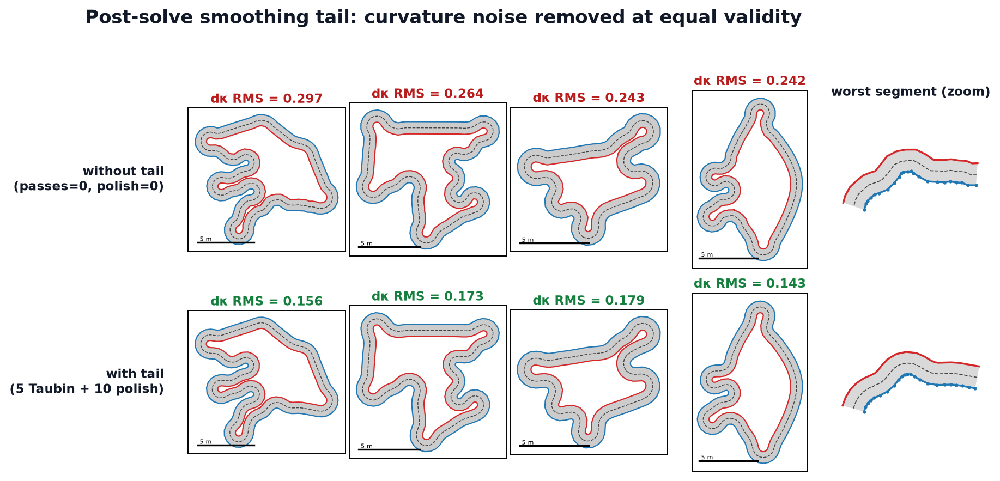

Track relaxation — the solver
=============================

This page covers how the fixed-iteration solve executes: the Jacobi double-buffering
that keeps it graph-capturable, the two separation execution modes, and the Chebyshev
semi-iterative acceleration that is the substance of the recent update. The
constraints themselves — separation, spacing, bending — are described in
:doc:`constraints`.

Jacobi semantics via double buffering
-------------------------------------

Every sweep reads one complete position buffer and writes updated positions into a
second buffer, then the two buffers are swapped. A bead's correction is computed from
its neighbours' *previous-sweep* positions, never from positions already updated within
the same sweep. That is **Jacobi** iteration (as opposed to Gauss-Seidel, which would
consume in-place updates as it goes).

Jacobi is the right choice here for two reasons:

1. **GPU parallelism.** Every bead's update is independent within a sweep, so the whole
   batch of ``E * N_max`` beads is one flat kernel launch with no ordering constraints
   and no atomics on the position buffers.
2. **Graph capture.** The launch sequence is fixed and data-independent (a known number
   of sweeps, each a fixed set of launches), so the entire solve captures once into a
   replayable CUDA graph and replays with zero per-call allocation. Gauss-Seidel's
   sequential dependence would serialize the beads and break the clean capture.

``xpbd_solve_inplace`` copies the input centerline into ``relaxed`` (``x_cur``), uses
``xpbd_db`` as the second buffer (``x_hat``), and ping-pongs the two across sweeps. Both
buffers are pre-allocated in ``RelaxScratch`` by the caller.

Separation execution modes
--------------------------

The non-local separation scan is the dominant cost — it is :math:`O(\text{count}[e]^2)`
per track when run densely. Two modes trade exactness against cost, selected by the
``relax_sep_*`` knobs.

Dense / cadenced mode
~~~~~~~~~~~~~~~~~~~~~~~

``_step_kernel`` scans all non-band neighbours whenever ``step_i % relax_sep_every == 0``;
spacing and bending still run every sweep. With ``relax_sep_cache_slots == 0`` and
``relax_sep_every > 1``, this is a naive skip cadence: there is simply no separation
force between dense scans.

Broadphase-cached mode
~~~~~~~~~~~~~~~~~~~~~~~~

When ``relax_sep_cache_slots > 0`` **and** ``relax_sep_every > 1``,
``_build_sep_cache_kernel`` refreshes a fixed-slot directed candidate list every
``relax_sep_every`` sweeps using radius ``target * (1 + relax_sep_cache_skin)``. Then
``_step_cached_kernel`` runs **every** sweep, re-testing each cached candidate with the
exact current ``dist < target`` narrowphase before applying the separation push. The
cache arrays live in ``RelaxScratch``, including an overflow counter for beads whose
candidate list exceeded the configured slot count, so the mode stays allocation-free and
CUDA-graph-capturable.

The default config uses the cached mode (``relax_sep_cache_slots=16``,
``relax_sep_every=20``, ``relax_sep_cache_skin=0.5``). See :doc:`convergence` for the
``relax_sep_every`` short-run refresh pitfall.

Chebyshev acceleration
----------------------

The plain Jacobi sweeps can be accelerated with the **Chebyshev semi-iterative method**,
selected by ``relax_accel="chebyshev"`` (the default). This is the precedent from Macklin
et al., *"Unified Particle Physics for Real-Time Applications"* (2014), applied to
position-based-dynamics Jacobi. It cuts the sweeps needed for a given yield by roughly 3x
(see :doc:`convergence`).

Warmup, then blend
~~~~~~~~~~~~~~~~~~~

The first ``relax_cheby_start`` (default 8) sweeps run **plain Jacobi**, so the
separation contact set settles before acceleration engages. From then on, each sweep
runs the ordinary Jacobi step and then launches a small blend kernel
(``_accel_blend_kernel``) that combines the fresh Jacobi update with the current and
previous iterates:

.. math::

   x_{\text{new}} = \omega_k\big(\gamma\,(\hat{x} - x_{\text{cur}})
   + (x_{\text{cur}} - x_{\text{prev}})\big) + x_{\text{prev}},

where :math:`\hat{x}` is the Jacobi output for this sweep, :math:`\gamma` =
``relax_cheby_gamma`` (default 0.9) is a constant under-relaxation factor, and
:math:`\omega_k` is the per-sweep Chebyshev weight from a **host-precomputed** recurrence:

.. math::

   \omega_1 = 1,\quad \omega_2 = \frac{2}{2 - \rho^2},\quad
   \omega_{k+1} = \frac{4}{4 - \rho^2\,\omega_k},

with :math:`\rho` = ``relax_cheby_rho`` (default 0.98) the spectral-radius estimate of
the Jacobi iteration. The :math:`\gamma < 1` under-relaxation damps the contact-switching
noise that raw acceleration would otherwise amplify on the nonsmooth separation contacts.

The warmup sweeps skip the blend launch **entirely** rather than blending with
:math:`\omega = 1`: an :math:`\omega = 1` "identity" blend is not bit-exact in float
arithmetic, and skipping it also saves launches.

Three-buffer rotation and the transition trick
~~~~~~~~~~~~~~~~~~~~~~~~~~~~~~~~~~~~~~~~~~~~~~~~~

Acceleration needs a third buffer for the previous iterate :math:`x_{\text{prev}}`
(``cheb_prev`` in ``RelaxScratch``). Once engaged, the three buffers rotate each sweep:
the blended output becomes the next ``x_cur``, the old ``x_cur`` becomes the next
``x_prev``, and the freed buffer becomes the next sweep's Jacobi output — fully
overwritten by the step kernel before the blend reads it.

The subtle part is the very first accelerated sweep. There is no true previous iterate
yet, so the caller passes ``x_prev`` **aliasing** ``x_cur``. Then
:math:`(x_{\text{cur}} - x_{\text{prev}})` cancels exactly and :math:`\omega = 1` there,
making the result independent of the third buffer's contents. As a consequence
``cheb_prev`` is **never read before being written** within a solve — its initial
contents are irrelevant, so there is no zero-init and the solve is safe under CUDA graph
replay (where buffer contents persist between replays).

Graph-capture and zero-alloc
~~~~~~~~~~~~~~~~~~~~~~~~~~~~~~

The :math:`\omega` schedule is precomputed on the host and is **data-independent**, so
the accelerated solve is still a fixed launch sequence with no host sync or
data-dependent branching inside the loop. The whole solve remains CUDA-graph-capturable
and zero-alloc per call: ``cheb_prev`` is pre-allocated in ``RelaxScratch`` (the capture
path requires it; outside capture a missing buffer is allocated as a convenience for
tests).

Setting ``relax_accel="none"`` restores plain damped Jacobi wholesale — no blend kernel,
no third buffer, the legacy two-buffer ping-pong.

Smoothing tail
--------------

After the main sweep loop, an optional **post-solve smoothing tail** runs. It removes the
fine curvature noise the three constraints leave behind: the bending guard only fires
when the local radius drops below :math:`R_{\min}` (a deadband), so gentler
sub-:math:`R_{\min}` wiggles — small kinks that survive separation and spacing — are
invisible to *all three* constraints and never get smoothed by the main solve.

         on the worst border segment
   :align: center

   The four noisiest valid tracks (metric benchmark regime, identical seeds) without the
   tail (top) and with the default tail (bottom); the per-panel number is the
   curvature-noise metric (dkappa RMS — RMS of adjacent Menger-curvature differences,
   scaled by half-width). The 5th column zooms the most rippled border segment of the
   worst track: the sub-:math:`R_{\min}` wiggle on the outer border (top) is gone after
   the tail (bottom). Across the full benchmark (E=4096) the default tail cuts curvature
   noise by **−30% / −34%** (hard / defaults regime) with **zero yield loss** and a
   slightly **improved** spacing RMS.

Taubin, not Laplacian
~~~~~~~~~~~~~~~~~~~~~~~

The tail uses **Taubin smoothing** — shrink-free Laplacian smoothing. One pass is two
Laplacian half-steps over the circular bead chain:

.. math::

   x \mathrel{+}= \lambda\, L(x), \qquad x \mathrel{+}= \mu\, L(x),
   \qquad L(x_i) = \tfrac{1}{2}(x_{i-1} + x_{i+1}) - x_i,

with :math:`\lambda = 0.5` (a positive shrinking step) and :math:`\mu = -0.53` (a slightly
larger negative un-shrinking step). Because :math:`\mu < -\lambda`, the two half-steps
cancel the low-frequency shrink while still attenuating high-frequency noise — the pass
smooths without pulling the curve inward. This matters for validity: a **plain** Laplacian
(:math:`\mu = 0`) shrinks corners, dragging them back through the thickness gate — in the
prototype 10 plain-Laplacian passes collapsed yield to 0.12. The :math:`\lambda`/:math:`\mu`
constants are hardcoded (not config); only the pass counts are exposed.

Two knobs
~~~~~~~~~

- ``relax_smooth_passes`` (default 5) — number of Taubin passes (each two half-steps).
- ``relax_smooth_spacing_iters`` (default 10) — spacing-only polish sweeps applied after
  the Taubin passes (the ordinary edge-spacing correction with separation and bending
  off), which restore the bead uniformity the Taubin passes perturb.

Setting both to 0 disables the tail. In the prototype the default tail cut
curvature-difference RMS ~33% on average (~51% on the worst track) with zero validity
loss and slightly *improved* spacing RMS.

Graph-capture and zero-alloc
~~~~~~~~~~~~~~~~~~~~~~~~~~~~~~

The tail simply continues the read/write ping-pong from wherever the main loop left it
(the Chebyshev previous-iterate buffer is not used). Its launch sequence is a fixed,
data-independent function of the two pass counts, with no per-call allocation, so it stays
CUDA-graph-capturable exactly like the main solve. The Taubin passes reuse a small
count-aware kernel (``_taubin_kernel``, NaN-preserving on padding beads); the spacing
polish reuses the main ``_step_kernel`` with separation and bending switched off.
