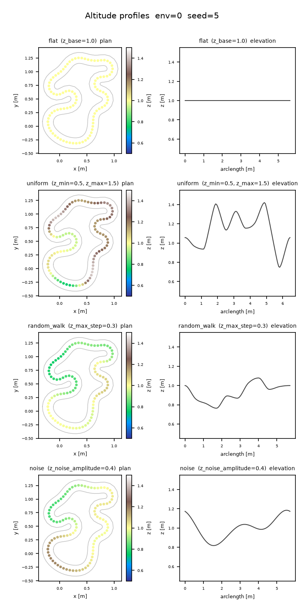

2.5D tracks
===========

Tracks (``TrackGenerator``, tutorial at :doc:`/tutorials/batch-of-tracks`) are
**2.5D**, exactly like :doc:`gate courses </gates-3d>`: the plan-view layout comes
from the proven 2D centerline generators and XPBD relaxer, and altitude (Z) is
layered on afterwards as a first-class elevation stage. The result is a genuine
3D road — every ``Track`` boundary point carries a ``vec3f`` position, distances
and speed profiles account for real climbing/descending, and a heightfield can be
baked for an external physics solver — without giving up any of the 2D pipeline's
layout quality, determinism, or (at the default settings) its exact numeric output.

Why 2.5D
--------

The 2D track pipeline — resample to constant spacing, XPBD-relax, inflate into a
constant-width band — is a plan-view (XY) computation and stays **bit-identical**
to the pre-elevation era. Altitude is added as a separate stage that runs on the
already-offset 2D borders, *before* the lift to ``vec3f``. Concretely, in
``inflate_warp`` (``track_gen/_src/warp_pipeline.py``) the stage order is:

.. code-block:: text

   resample -> frame + curvature -> arc length -> winding -> offset (outer/inner)
       -> Z PROFILE (writes per-point z) -> validity -> LIFT to vec3f
       -> [non-flat only] recompute 3D tangent + true 3D arc length

On the default ``z_profile="flat"`` with ``z_base=0.0`` the lift writes a constant
``z = 0.0`` and the arc-length/tangent tables are left untouched from the 2D
stages — bit-identical to the legacy planar path (this is golden-verified; see
``tests/test_golden_migration.py``). On any other profile, the per-point altitude
computed by ``warp_zprofile.apply_z_profile`` (the same profiler used by
:doc:`gate courses </gates-3d>`) is applied to ``outer``/``center``/``inner``
together, and a follow-up kernel (``_track_frames3_k``) recomputes the tangent and
the true 3D arc length from the now-3D centerline.

Altitude profiles
------------------

``TrackGenConfig.z_profile`` selects the altitude family — the identical four
options and knobs as :doc:`gate courses </gates-3d>` (both configs are read
through the same ``apply_z_profile`` entry point). All four write every real
centerline point and NaN the padding's xy; z carries the flat path's ``z_base``
(0 by default) at every slot, padding included. The ``z_*`` knobs below are
inert for the profiles they do not apply to.

.. list-table::
   :header-rows: 1
   :widths: 18 52 30

   * - ``z_profile``
     - Altitude model
     - Knobs
   * - ``"flat"`` (default)
     - Planar. Every real point sits at ``z_base``; with the default
       ``z_base=0`` this is the old planar track.
     - ``z_base``
   * - ``"uniform"``
     - Independent hill heights: ``z_control_points`` arc-spaced knots each
       draw their own i.i.d. uniform altitude in ``[z_min, z_max]``, and the
       points between knots are interpolated (see *Smoothness* below).
     - ``z_min``, ``z_max``, ``z_control_points``
   * - ``"random_walk"``
     - Correlated rolling terrain: a grade-capped walk over the
       ``z_control_points`` knots, clamped to ``[z_min, z_max]`` and closed
       back to its start so the loop is continuous (Brownian-bridge drift
       removal). Each knot-to-knot step is capped by a **grade** — the
       maximum ``|dz|`` per unit of plan-view arc length between knots — so
       altitude changes stay proportional to horizontal travel.
     - ``z_base`` (walk origin), ``z_min``, ``z_max``, ``z_max_step`` (grade
       cap), ``z_control_points``
   * - ``"noise"``
     - Smooth periodic terrain with harmonic control: decided per-point (not
       knot-based) as a sum of ``z_noise_harmonics`` sinusoids of total
       amplitude ``z_noise_amplitude`` oscillating around ``z_base``, clamped
       to ``[z_min, z_max]``.
     - ``z_base``, ``z_noise_amplitude``, ``z_noise_harmonics`` (default 3),
       ``z_min``, ``z_max``

``z_control_points`` is not itself a ``z_profile`` — it is the knot-count knob
used by the ``uniform`` and ``random_walk`` rows above: the number of
arc-spaced altitude control knots (default 10, must be ≥ 3) those two
profiles interpolate between. It is inert for ``flat`` (constant altitude,
no knots) and for ``noise`` (per-point, decided by frequency via
``z_noise_harmonics`` instead of knot count).

.. note::

   ``z_max_step`` is a **grade**, not an absolute step. Under the knot stage
   (``uniform``, ``random_walk``) it bounds ``|dz|`` per unit plan-view arc
   length **between adjacent knots** (``ds = perimeter / z_control_points``),
   not between adjacent resampled points — so, for a fixed ``z_max_step``, the
   walk can now swing over a larger total altitude range than it could when
   the cap applied point-to-point. This is an intentional, user-visible
   change from the previous per-point grade cap: it is what fixes the
   washboard texture described below, at the cost of ``z_max_step`` alone no
   longer bounding how much altitude changes over any one resampled segment.

A profiled batch can also be rejected outright: ``z_valid_grade`` is the maximum
allowed ``|dz|/ds`` grade between adjacent points, with ``ds`` measured along the
**plan-view** (XY) arc length — not the 3D lifted length. ``z_valid_grade = 0``
(the default) disables the check; any steeper adjacent pair marks the whole env
invalid, on top of the unchanged 2D validity gate (turning number, thickness,
width floor, optional border self-intersection). Because a monotone-cubic
segment can overshoot its secant slope by up to 3× (see *Smoothness* below),
``z_max_step`` alone does not bound the realized per-point grade on ``uniform``
or ``random_walk`` — ``z_valid_grade`` is what actually gates realized
steepness, and should be set (non-zero) whenever a hard grade limit matters.

.. note::

   **Migration note for existing** ``z_valid_grade`` **users.** The knot-based
   walk (above) raised the realized per-point grade to roughly 1.5×
   ``z_max_step`` (up from roughly 1.08× under the old per-point-capped walk).
   If you already had ``z_valid_grade`` set to a fixed value roughly in the
   1.1×-1.7× range of your ``z_max_step``, batches will now return noticeably
   fewer valid envs than before, because more adjacent-point grades cross that
   threshold. Measured with ``random_walk``, 64 envs: at ``z_max_step=0.3``,
   ``z_valid_grade=0.35`` went from 63/64 valid to 21/64; at 0.40, from 64/64
   to 40/64; at 0.45, from 64/64 to 58/64. The default ``z_valid_grade=0``
   (check disabled) is completely unaffected — no action needed if you never
   set it. If your ``z_valid_grade`` falls in that affected range, raise it
   (comfortably above ~1.7× ``z_max_step`` to recover the old acceptance rate)
   or lower ``z_max_step``.

Smoothness
----------

For ``uniform`` and ``random_walk``, altitude is decided at only
``z_control_points`` arc-spaced knots per env and interpolated between them
with a periodic monotone cubic (Fritsch-Carlson-limited tangents, wrapping at
the seam so the loop closes with no discontinuity). Two consequences follow
directly:

- **Exact bounds, no post-clamp.** Each knot's altitude is guaranteed to fall
  in ``[z_min, z_max]`` before interpolation even runs (it comes from the same
  per-point profile kernel, run over the knots instead of the resampled
  points): ``uniform`` draws each knot directly in that range, and
  ``random_walk`` clamps its walk to it. The monotone construction then
  guarantees the interpolant never leaves the interval spanned by its two
  bracketing knots. So the whole curve stays within ``[z_min, z_max]``
  exactly, with no additional clamping step required or applied.
- **Resolution and bumpiness are decoupled.** Raising the track's resample
  resolution samples the SAME underlying road more finely; it does not add
  new altitude decisions or introduce new bumps, because the road between
  knots is a fixed cubic, not a fresh per-point draw. This is what eliminates
  the washboard texture that a per-point ``uniform``/``random_walk`` draw
  produces at high resample density — the previous per-point grade cap capped
  local jitter but never removed it.

That decoupling only holds while ``z_control_points`` stays well below the
resampled point count; a very large ``z_control_points`` starts to
reintroduce, knot by knot, the same per-point jitter this feature is meant to
replace (measured: ``z_control_points=200`` on a ~95-point track produces 65
direction changes along the profile).

The one caveat: monotonicity bounds the interpolant's *range*, not its local
*slope*. A monotone-cubic segment's realized grade can reach up to 3× its
knot-to-knot secant slope (the same Fritsch-Carlson limiter that kills
overshoot also sets that bound), so ``z_max_step`` — which only shapes the
walk *at the knots* — does not bound the steepest per-point grade actually
realized between them. If a hard steepness limit matters for your use case,
set ``z_valid_grade`` (non-zero) rather than relying on ``z_max_step`` alone;
it is checked against the realized per-point grade after interpolation, on
every adjacent pair.

         a plan view colored by z and an elevation profile
   :align: center

   The four altitude profiles on the SAME plan-view layout and seed, rendered
   by ``viz/plot_z_profiles.py`` (``z_base=1.0``, ``z_min=0.5``, ``z_max=1.5``,
   ``z_max_step=0.3``, ``z_noise_amplitude=0.4``, ``z_control_points=10``).
   ``flat`` is constant; ``uniform``, ``random_walk``, and ``noise`` are all
   smooth rolling curves (never jittery), but visibly distinct in character —
   independent knot-to-knot swings, a correlated single-basin walk, and
   harmonic periodicity respectively. Regenerate with
   ``python viz/plot_z_profiles.py --out docs/_static/z-profiles.png --seed 5``.

Level cross-sections, and why plan-view collision stays valid
---------------------------------------------------------------

The elevation stage lifts ``outer``, ``center``, and ``inner`` **together**: at
every centerline index ``i``, all three boundary points share the same ``z``
(``_lift_track_zvar_k`` — "level cross-sections"). Two consequences fall out of
this directly:

- The per-point half-width recovery ``‖outer[i] - center[i]‖`` still works
  unmodified: since ``outer[i]`` and ``center[i]`` share a ``z``, the vertical
  component cancels and the norm is exactly the plan-view (XY) half-width, lifted
  track or not.
- **Out-of-bounds collision stays a plan-view check.** ``CollisionChecker``
  (:doc:`/utilities/collision`) drops every boundary point's ``z`` before
  comparing against the query box (it only ever reads ``wp.vec2f(p[0], p[1])``
  off the ``vec3f`` inputs) — so an agent's XY position is checked against the
  SAME road cross-section regardless of the track's altitude at that point. This
  is deliberate: elevation never changes *where* the drivable band is in plan
  view (the offset stage that produces ``outer``/``inner`` runs entirely in 2D,
  before the Z profile is even computed — see the stage order above), so a
  collision engine that only understands XY keeps working exactly as before.

One v1 limitation carries over from the general 2.5D design and is listed in full
on the :doc:`gate courses page </gates-3d>`: plan-view self-crossings are still
rejected for tracks (unlike gates, a track's plan view is not allowed to cross
itself). The other 2.5D limitation is specific to this page and the spec's
non-goals: the elevation stage does not add any tube/banking geometry — a lifted
track is a ribbon of level cross-sections, not a banked surface.

3D distance semantics
----------------------

Once a track is lifted, every distance-measuring utility in the package reads the
LIFTED (3D) geometry rather than its plan-view projection, with one exception
(collision, above) that is plan-view by design:

- ``Track.arclen``/``Track.length`` — cumulative and total arc length along the
  centerline. For the default flat profile this is the plan-view length; for a
  non-flat profile it is the TRUE 3D length of the lifted centerline, strictly
  greater than the plan-view length whenever the profile is non-constant (a hilly
  loop is longer in 3D than in plan view).
- ``Track.tangent`` — for a non-flat profile this is a true 3D central
  difference over the lifted centerline (``_track_frames3_k``), not the 2D
  tangent. ``Track.normal``, by contrast, is computed BEFORE the lift and stays
  the plan-view left-normal at ``z = 0`` — it is not re-derived from the 3D
  tangent, so ``normal = (-tangent.y, tangent.x, 0)`` no longer holds literally
  on a lifted track (the XY *direction* still matches, but ``tangent`` is
  3D-unit-length, so its XY projection alone is sub-unit).
- ``track_gen.props.PropSampler`` and ``track_gen.checkpoints.CheckpointSampler``
  share the same boundary-scanning kernel (``_scan_boundary_k``), whose snap
  spacing and reported ``PropSet.step``/``length`` (points and segments modes
  alike) are measured along the true 3D polyline — identical to the planar
  length whenever ``z = 0``, but a genuine 3D chord/arc-step on a lifted track.
- ``track_gen.localize.curvature()`` keeps its turn-angle NUMERATOR exactly
  plan-view (unaffected by grade on its own), but its denominator does pick up a
  z contribution: a plan-view turn taken on a graded section reads a slightly
  smaller magnitude than the same turn flat, and a steep enough grade reversal
  (a sharp crest or dip) on an otherwise straight section can register as a
  spurious sharp turn. ``speed_profile()`` inherits that ``kappa`` as its
  corner-speed limit, but its accel/brake ``ds`` is the true 3D segment length,
  so the distance budget for accelerating out of / braking into a corner
  accounts for the real climbing/descending path length.

``PropSet.position``
----------------------

:class:`track_gen.props.PropSet` (:doc:`/utilities/props`) already carries
``vec3f`` positions: on a flat track every prop's ``z`` is 0, and on a lifted
track each prop's ``z`` tracks the boundary elevation at its sample point (an
on-curve sample in ``"points"`` mode, a chord midpoint in ``"segments"`` mode) —
no code change is needed to place props on an elevated road; the sampler was
built vec3f-native alongside the rest of the 2.5D work.

.. admonition:: Breaking changes
   :class: warning

   ``PropSet.position`` changed from ``vec2f`` to ``vec3f`` as part of the 2.5D
   work. Downstream code that reshapes it as ``.reshape(-1, 2)`` will break;
   update it to ``.reshape(-1, 3)``.

Heightfield
-----------

For external physics solvers that want a grid rather than a polyline,
``track_gen.heightfield.HeightFieldBaker`` bakes each env's road surface
into a square height grid. It is not driven directly in normal use: set
``CourseConfig.heightfield_resolution`` (track mode only, ``>= 8``) and the
:doc:`Course facade </utilities/course>` builds and re-bakes it on every
``generate()`` alongside the SDF bake, exposed as ``course.heightfield``:

.. code-block:: python

   from track_gen.course import Course, CourseConfig

   course = Course(CourseConfig(mode="track", gen=config, seeds=0,
                                checkpoint_spacing=0.6,
                                heightfield_resolution=96))
   course.generate()
   hf = course.heightfield.bake()          # HeightField; re-bakes from the CURRENT batch
   grid = hf.height.numpy().reshape(config.num_envs, 96, 96)  # [E, res, res], row-major (y, x)

Every texel takes the road ``z`` of the NEAREST centerline cross-section by
plan-view distance: on-road texels get the exact road surface, and off-road
texels continue the nearest edge's height outward, so the surface has no cliff
at the road edge. Flat tracks bake a constant ``z_base`` sheet; invalid or
degenerate envs (``Track.valid[e] == 0`` or fewer than 3 real points) bake
``NaN`` across the whole env. The per-env world AABB is the plan-view band's
bounding box plus padding (AUTO: 10% of the env's larger extent, matching the SDF
baker's convention), and texel ``(x, y)`` centers map to world coordinates as:

.. code-block:: text

   world = lo + ((x, y) + 0.5) / res * (hi - lo)

with ``lo``/``hi`` the per-env ``[E]`` ``vec2f`` AABB corners (``HeightField.lo``/
``HeightField.hi``) and ``res`` the grid resolution (``HeightField.res``).

.. figure:: _static/tracks-25d.png
   :alt: Three 2.5D tracks, each as a plan view, an elevation profile, and a
         baked heightfield
   :align: center

   Three tracks rendered by ``viz/plot_tracks_3d.py``
   (``z_profile="random_walk"``, ``z_base=1.0``, ``z_min=0.2``, ``z_max=2.0``,
   ``z_max_step=0.3``). Each row is one env: plan view (filled band + outer/inner
   borders + dashed centerline), elevation profile (arc length vs. centerline
   z), and the baked heightfield (``imshow``, extent from ``lo``/``hi``, with the
   plan-view centerline overlaid) — the heightfield's ridge tracks the same
   climbs and dips visible in the elevation panel, at the same plan-view
   location. Regenerate with
   ``python viz/plot_tracks_3d.py --out docs/_static/tracks-25d.png --envs 3 --seed 5``.

See also
--------

- :doc:`/gates-3d` — the same elevation stage applied to gate sequences, plus the
  ``gate_align`` frame-tilting choice and the 3D ``CourseLine`` runtime.
- :doc:`/tutorials/batch-of-tracks` — the end-to-end track-generation recipe.
- :doc:`/utilities/course` — the ``Course`` facade, including
  ``CourseConfig.heightfield_resolution``.
- :doc:`/utilities/props` — boundary prop sampling, vec3f-native on lifted
  tracks.
- :doc:`/utilities/localize` — ``curvature()`` and ``speed_profile()``, whose
  behavior on lifted tracks is detailed above.
- :doc:`/utilities/collision` — the plan-view out-of-bounds checker.
