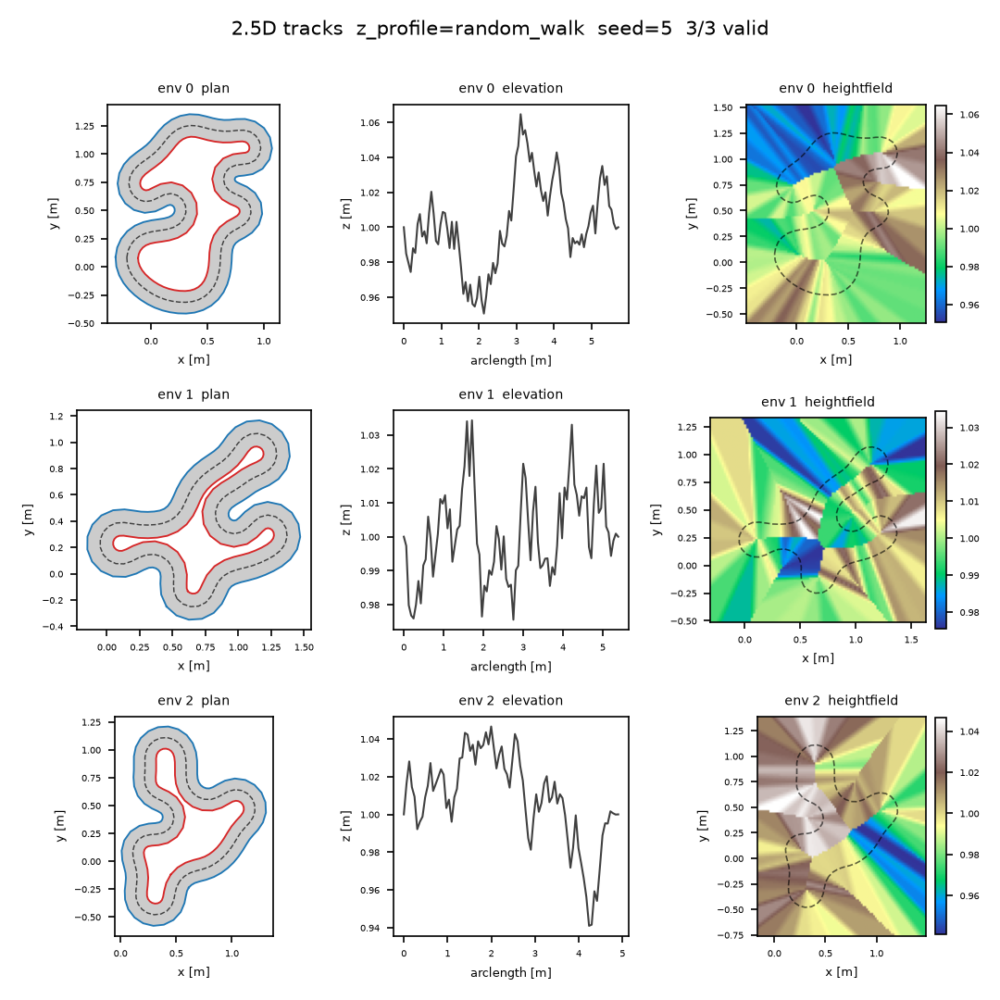

2.5D tracks
===========

Tracks (``TrackGenerator``, tutorial at :doc:`/tutorials/batch-of-tracks`) are
**2.5D**, exactly like :doc:`gate courses </gates-3d>`: the plan-view layout comes
from the proven 2D centerline generators and XPBD relaxer, and altitude (Z) is
layered on afterwards as a first-class elevation stage. The result is a genuine
3D road — every ``Track`` boundary point carries a ``vec3f`` position, distances
and speed profiles account for real climbing/descending, and a heightfield can be
baked for an external physics solver — without giving up any of the 2D pipeline's
layout quality, determinism, or (at the default settings) its exact numeric output.

Why 2.5D
--------

The 2D track pipeline — resample to constant spacing, XPBD-relax, inflate into a
constant-width band — is a plan-view (XY) computation and stays **bit-identical**
to the pre-elevation era. Altitude is added as a separate stage that runs on the
already-offset 2D borders, *before* the lift to ``vec3f``. Concretely, in
``inflate_warp`` (``track_gen/_src/warp_pipeline.py``) the stage order is:

.. code-block:: text

   resample -> frame + curvature -> arc length -> winding -> offset (outer/inner)
       -> Z PROFILE (writes per-point z) -> validity -> LIFT to vec3f
       -> [non-flat only] recompute 3D tangent + true 3D arc length

On the default ``z_profile="flat"`` with ``z_base=0.0`` the lift writes a constant
``z = 0.0`` and the arc-length/tangent tables are left untouched from the 2D
stages — bit-identical to the legacy planar path (this is golden-verified; see
``tests/test_golden_migration.py``). On any other profile, the per-point altitude
computed by ``warp_zprofile.apply_z_profile`` (the same profiler used by
:doc:`gate courses </gates-3d>`) is applied to ``outer``/``center``/``inner``
together, and a follow-up kernel (``_track_frames3_k``) recomputes the tangent and
the true 3D arc length from the now-3D centerline.

Altitude profiles
------------------

``TrackGenConfig.z_profile`` selects the altitude family — the identical four
options and knobs as :doc:`gate courses </gates-3d>` (both configs are read
through the same ``apply_z_profile`` entry point). All four write every real
centerline point and leave the padding at ``z = 0``; the ``z_*`` knobs below are
inert for the profiles they do not apply to.

.. list-table::
   :header-rows: 1
   :widths: 18 52 30

   * - ``z_profile``
     - Altitude model
     - Knobs
   * - ``"flat"`` (default)
     - Every real point sits at ``z_base``. With the default ``z_base=0`` this is
       the old planar track.
     - ``z_base``
   * - ``"uniform"``
     - Each point's altitude is drawn i.i.d. uniform in ``[z_min, z_max]``.
     - ``z_min``, ``z_max``
   * - ``"random_walk"``
     - A Brownian-bridge walk clamped to ``[z_min, z_max]``, closed back to its
       start so the loop is continuous. Each step is capped by a **grade** — the
       maximum ``|dz|`` per unit of plan-view arc length — so altitude changes
       stay proportional to horizontal travel.
     - ``z_base`` (walk origin), ``z_min``, ``z_max``, ``z_max_step`` (grade cap)
   * - ``"noise"``
     - Periodic harmonic noise oscillating around ``z_base``: a sum of
       ``z_noise_harmonics`` sinusoids of total amplitude ``z_noise_amplitude``,
       clamped to ``[z_min, z_max]``.
     - ``z_base``, ``z_noise_amplitude``, ``z_noise_harmonics`` (default 3),
       ``z_min``, ``z_max``

.. note::

   ``z_max_step`` is a **grade**, not an absolute step: it bounds ``|dz|`` per
   unit plan-view arc length between adjacent resampled points, so widely spaced
   points may still differ in altitude by more than ``z_max_step``.

A profiled batch can also be rejected outright: ``z_valid_grade`` is the maximum
allowed ``|dz|/ds`` grade between adjacent points, with ``ds`` measured along the
**plan-view** (XY) arc length — not the 3D lifted length. ``z_valid_grade = 0``
(the default) disables the check; any steeper adjacent pair marks the whole env
invalid, on top of the unchanged 2D validity gate (turning number, thickness,
width floor, optional border self-intersection).

Level cross-sections, and why plan-view collision stays valid
---------------------------------------------------------------

The elevation stage lifts ``outer``, ``center``, and ``inner`` **together**: at
every centerline index ``i``, all three boundary points share the same ``z``
(``_lift_track_zvar_k`` — "level cross-sections"). Two consequences fall out of
this directly:

- The per-point half-width recovery ``‖outer[i] - center[i]‖`` still works
  unmodified: since ``outer[i]`` and ``center[i]`` share a ``z``, the vertical
  component cancels and the norm is exactly the plan-view (XY) half-width, lifted
  track or not.
- **Out-of-bounds collision stays a plan-view check.** ``CollisionChecker``
  (:doc:`/utilities/collision`) drops every boundary point's ``z`` before
  comparing against the query box (it only ever reads ``wp.vec2f(p[0], p[1])``
  off the ``vec3f`` inputs) — so an agent's XY position is checked against the
  SAME road cross-section regardless of the track's altitude at that point. This
  is deliberate: elevation never changes *where* the drivable band is in plan
  view (the offset stage that produces ``outer``/``inner`` runs entirely in 2D,
  before the Z profile is even computed — see the stage order above), so a
  collision engine that only understands XY keeps working exactly as before.

Two v1 limitations carry over from the general 2.5D design, listed in full on the
:doc:`gate courses page </gates-3d>`: plan-view self-crossings are still rejected
for tracks (unlike gates, a track's plan view is not allowed to cross itself), and
the elevation stage does not add any tube/banking geometry — a lifted track is a
ribbon of level cross-sections, not a banked surface.

3D distance semantics
----------------------

Once a track is lifted, every distance-measuring utility in the package reads the
LIFTED (3D) geometry rather than its plan-view projection, with one exception
(collision, above) that is plan-view by design:

- ``Track.arclen``/``Track.length`` — cumulative and total arc length along the
  centerline. For the default flat profile this is the plan-view length; for a
  non-flat profile it is the TRUE 3D length of the lifted centerline, strictly
  greater than the plan-view length whenever the profile is non-constant (a hilly
  loop is longer in 3D than in plan view).
- ``Track.tangent`` — for a non-flat profile this is a true 3D central
  difference over the lifted centerline (``_track_frames3_k``), not the 2D
  tangent. ``Track.normal``, by contrast, is computed BEFORE the lift and stays
  the plan-view left-normal at ``z = 0`` — it is not re-derived from the 3D
  tangent, so ``normal = (-tangent.y, tangent.x, 0)`` no longer holds literally
  on a lifted track (the XY *direction* still matches, but ``tangent`` is
  3D-unit-length, so its XY projection alone is sub-unit).
- ``track_gen.props.PropSampler`` and ``track_gen.checkpoints.CheckpointSampler``
  share the same boundary-scanning kernel (``_scan_boundary_k``), whose snap
  spacing and reported ``PropSet.step``/``length`` (points and segments modes
  alike) are measured along the true 3D polyline — identical to the planar
  length whenever ``z = 0``, but a genuine 3D chord/arc-step on a lifted track.
- ``track_gen.localize.curvature()`` keeps its turn-angle NUMERATOR exactly
  plan-view (unaffected by grade on its own), but its denominator does pick up a
  z contribution: a plan-view turn taken on a graded section reads a slightly
  smaller magnitude than the same turn flat, and a steep enough grade reversal
  (a sharp crest or dip) on an otherwise straight section can register as a
  spurious sharp turn. ``speed_profile()`` inherits that ``kappa`` as its
  corner-speed limit, but its accel/brake ``ds`` is the true 3D segment length,
  so the distance budget for accelerating out of / braking into a corner
  accounts for the real climbing/descending path length.

``PropSet.position``
----------------------

:class:`track_gen.props.PropSet` (:doc:`/utilities/props`) already carries
``vec3f`` positions: on a flat track every prop's ``z`` is 0, and on a lifted
track each prop's ``z`` tracks the boundary elevation at its sample point (an
on-curve sample in ``"points"`` mode, a chord midpoint in ``"segments"`` mode) —
no code change is needed to place props on an elevated road; the sampler was
built vec3f-native alongside the rest of the 2.5D work.

Heightfield
-----------

For external physics solvers that want a grid rather than a polyline,
``track_gen._src.heightfield.HeightFieldBaker`` bakes each env's road surface
into a square height grid. It is not driven directly in normal use: set
``CourseConfig.heightfield_resolution`` (track mode only, ``>= 8``) and the
:doc:`Course facade </utilities/course>` builds and re-bakes it on every
``generate()`` alongside the SDF bake, exposed as ``course.heightfield``:

.. code-block:: python

   from track_gen.course import Course, CourseConfig

   course = Course(CourseConfig(mode="track", gen=config, seeds=0,
                                checkpoint_spacing=0.6,
                                heightfield_resolution=96))
   course.generate()
   hf = course.heightfield.bake()          # HeightField; re-bakes from the CURRENT batch
   grid = hf.height.numpy().reshape(config.num_envs, 96, 96)  # [E, res, res], row-major (y, x)

Every texel takes the road ``z`` of the NEAREST centerline cross-section by
plan-view distance: on-road texels get the exact road surface, and off-road
texels continue the nearest edge's height outward, so the surface has no cliff
at the road edge. Flat tracks bake a constant ``z_base`` sheet; invalid or
degenerate envs (``Track.valid[e] == 0`` or fewer than 3 real points) bake
``NaN`` across the whole env. The per-env world AABB is the plan-view band's
bounding box plus padding (AUTO: 10% of the env's larger extent, matching the SDF
baker's convention), and texel ``(x, y)`` centers map to world coordinates as:

.. code-block:: text

   world = lo + ((x, y) + 0.5) / res * (hi - lo)

with ``lo``/``hi`` the per-env ``[E]`` ``vec2f`` AABB corners (``HeightField.lo``/
``HeightField.hi``) and ``res`` the grid resolution (``HeightField.res``).

         baked heightfield
   :align: center

   Three tracks rendered by ``viz/plot_tracks_3d.py``
   (``z_profile="random_walk"``, ``z_base=1.0``, ``z_min=0.2``, ``z_max=2.0``,
   ``z_max_step=0.3``). Each row is one env: plan view (filled band + outer/inner
   borders + dashed centerline), elevation profile (arc length vs. centerline
   z), and the baked heightfield (``imshow``, extent from ``lo``/``hi``, with the
   plan-view centerline overlaid) — the heightfield's ridge tracks the same
   climbs and dips visible in the elevation panel, at the same plan-view
   location. Regenerate with
   ``python viz/plot_tracks_3d.py --out docs/_static/tracks-25d.png --envs 3 --seed 5``.

See also
--------

- :doc:`/gates-3d` — the same elevation stage applied to gate sequences, plus the
  ``gate_align`` frame-tilting choice and the 3D ``CourseLine`` runtime.
- :doc:`/tutorials/batch-of-tracks` — the end-to-end track-generation recipe.
- :doc:`/utilities/course` — the ``Course`` facade, including
  ``CourseConfig.heightfield_resolution``.
- :doc:`/utilities/props` — boundary prop sampling, vec3f-native on lifted
  tracks.
- :doc:`/utilities/localize` — ``curvature()`` and ``speed_profile()``, whose
  behavior on lifted tracks is detailed above.
- :doc:`/utilities/collision` — the plan-view out-of-bounds checker.
