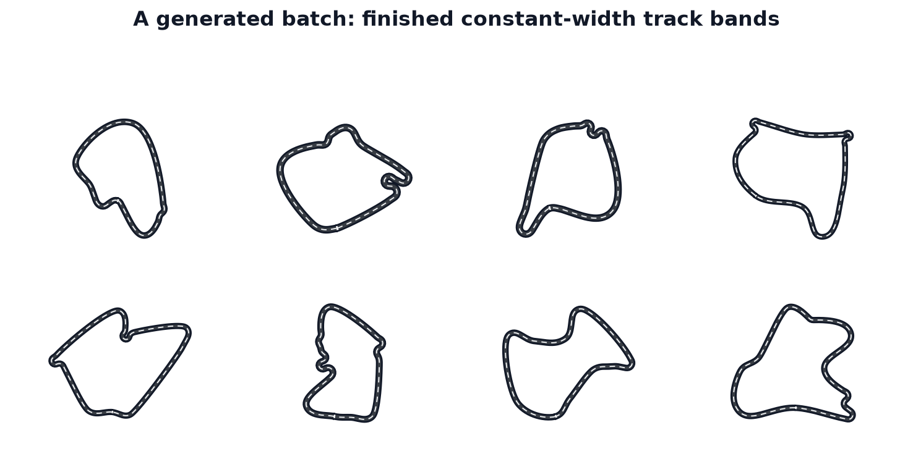

Generating a Batch of Tracks
============================

``TrackGenerator`` produces a whole batch of closed, constant-width racing
tracks in one call: a centerline generator draws a centerline per environment,
the pipeline resamples it at constant arc spacing, XPBD-relaxes it so it is
inflatable, and inflates it into a road band. This tutorial walks the end-to-end
workflow — build a config and RNG, call ``generate()``, read the output arrays,
work with the real points per environment — and then drives an agent against the
finished tracks with the built-in collision engine.

Prerequisites
-------------

Install ``track_gen`` with the ``dev`` extra (pulls in ``warp-lang``, ``torch``,
and the rest of the development dependencies):

.. code-block:: bash

   uv pip install -e ".[dev]"

Building the Track Config and RNG
---------------------------------

``TrackGenConfig`` holds every generation parameter. The two required fields are
``num_envs`` (batch size) and ``device`` (``"cpu"`` or ``"cuda"``).
``half_width`` is the road half-width in world units and defaults to ``0.1``.

.. code-block:: python

   import warp as wp
   wp.init()

   from track_gen import TrackGenerator, TrackGenConfig, PerEnvSeededRNG

   E, device = 64, "cuda"  # or "cpu"
   config = TrackGenConfig(num_envs=E, half_width=0.03, device=device)
   rng = PerEnvSeededRNG(seeds=0, num_envs=E, device=device)

``PerEnvSeededRNG`` derives one independent seed per environment from the master
seed. Passing an integer broadcasts the same master seed across all environments;
passing a 1-D array of length ``E`` sets per-environment seeds directly.

Generating the Track Batch
--------------------------

.. code-block:: python

   generator = TrackGenerator(config, rng)
   track = generator.generate()

``TrackGenerator.__init__`` pre-allocates all GPU buffers (generator scratch,
pipeline scratch, seed buffers, and the persistent ``Track``) exactly once. On
``cuda``, the first ``generate()`` call warms the kernels, captures the entire
pipeline into a single replayable ``wp.Graph``, and immediately replays it.
Subsequent calls copy the updated seeds into the fixed seed buffer and replay the
same graph.

.. note::

   ``TrackGenerator`` is **fixed-batch**: ``generate()`` always produces exactly
   ``config.num_envs`` tracks. Passing an explicit environment-id sequence is not
   supported because the CUDA graph captures one fixed batch shape.

Reading the Output Fields
-------------------------

``track`` is a ``Track`` dataclass whose fields are flat Warp arrays. Use
``wp.to_torch`` to get PyTorch views:

.. code-block:: python

   center = wp.to_torch(track.center).view(E, config.N_max, 3)
   outer  = wp.to_torch(track.outer).view(E, config.N_max, 3)
   inner  = wp.to_torch(track.inner).view(E, config.N_max, 3)
   valid  = wp.to_torch(track.valid).bool()
   count  = wp.to_torch(track.count)

The full field table:

.. list-table::
   :header-rows: 1

   * - Field
     - Shape
     - Meaning
   * - ``outer``, ``center``, ``inner``
     - ``[E, N_max, 2]``
     - Border / centerline / border points. All three are index-aligned: the same
       cross-section normal passes through ``outer[e, i]``, ``center[e, i]``, and
       ``inner[e, i]``.
   * - ``tangent``, ``normal``
     - ``[E, N_max, 2]``
     - Unit tangent and left-normal along the centerline.
   * - ``arclen``
     - ``[E, N_max]``
     - Cumulative arc length (0 at index 0).
   * - ``length``
     - ``[E]``
     - Closed-loop perimeter for each environment.
   * - ``valid``
     - ``[E]`` bool
     - Per-track validity flag. Invalid tracks failed a geometric check
       (turning, thickness, NaNs, or road self-overlap).
   * - ``count``
     - ``[E]`` int
     - Real point count per track. Slots at index ``i >= count[e]`` are
       NaN-padded.

Slicing Real Points
-------------------

``track_gen`` uses **constant-spacing** output: each track is emitted at a
constant arc spacing rather than a fixed point count. The per-track point count
is ``count[e] = floor(perimeter / spacing) + 1``, capped at ``N_max``. Slots
beyond ``count[e]`` are filled with ``NaN``.

To work only with the real arc-uniform points for a given environment:

.. code-block:: python

   # Real centerline points for environment 0
   n0 = int(count[0])
   center_env0 = center[0, :n0]   # shape [n0, 2]
   outer_env0  = outer[0,  :n0]   # shape [n0, 2]
   inner_env0  = inner[0,  :n0]   # shape [n0, 2]

Track Figure
------------

         outer/inner borders and dashed centerlines.

   The end product of ``generate()``: finished constant-width road bands, each a
   filled band between the ``outer`` and ``inner`` borders with the ``center``
   line dashed through it. Every band came from one deterministic batch at the
   default ``half_width=0.03`` geometry.

Choosing ``spacing`` and ``N_max``
----------------------------------

The default ``spacing`` is ``None``, which auto-sets to ``0.6 * half_width``.
``N_max`` is the per-track point capacity: size it so that
``N_max >= max(perimeter) / spacing + 1`` and no track is silently truncated
(the default fat-band configuration leaves ample headroom). A smaller
``spacing`` yields a denser, smoother polyline at the cost of more points per
track (and a larger required ``N_max``); a larger ``spacing`` is cheaper but
coarser. See :doc:`/how-it-works/resample` for the constant-spacing
contract in depth.

Relaxing the Centerline
-----------------------

Between the constant-spacing resample and the inflation, the pipeline runs an
XPBD relaxation pass that opens self-approaches and rounds under-radius corners
so the constant-width band is inflatable. It is on by default and controlled by
the ``relax_*`` fields (``relax_enable``, ``relax_iters``, ``relax_accel``,
``relax_sep_every``, the smoothing tail, …). The defaults are tuned; reach for
these knobs only to trade yield against per-batch cost.

.. seealso::

   :doc:`/relaxation/overview` documents the relaxation stage — why a raw
   centerline is not inflatable, the thickness gate that decides ``valid``, and
   every ``relax_*`` knob with its effect on yield and cost.

Device Choice (cpu / cuda)
--------------------------

The same ``TrackGenerator`` API runs on both devices; only the ``device`` string
in ``TrackGenConfig`` changes. On ``cpu`` every ``generate()`` runs the pipeline
eagerly (no graph). On ``cuda`` the first call captures the pipeline into a
replayable ``wp.Graph`` and later calls are fast replays — the natural choice for
a batched RL loop. See :doc:`/tutorials/cuda-graph-in-a-sim` for the fixed-batch
contract, capture-vs-replay mechanics, and per-generator replay timings.

Buffer Reuse and Snapshots
--------------------------

The same ``Track`` instance and its underlying Warp arrays are **reused** on
every ``generate()`` call. If you need an independent snapshot — for example, to
keep the tracks from one episode while generating a fresh batch — call
``track.clone()``:

.. code-block:: python

   snapshot = track.clone()   # independent copy; safe to keep across generate()

Converting with ``wp.to_torch``
-------------------------------

``wp.to_torch`` returns a **zero-copy** PyTorch view of the underlying Warp
buffer. The view is only valid as long as the backing ``Track`` (or clone) is
alive. For a persistent tensor, call ``.clone()`` on the PyTorch side as well:

.. code-block:: python

   center_torch = wp.to_torch(track.center).view(E, config.N_max, 3).clone()

Driving Against the Track: Collision for RL
-------------------------------------------

Generation gives you the geometry; an RL or controller loop also needs to know,
each step, *is the agent still on the track?* and *how far along has it got?* The
:doc:`Course facade </utilities/course>` bundles generation with the built-in
out-of-bounds collision checker and the checkpoint/progress tracker in one
object, so you never wire those together by hand. Its lifecycle is
**construct → bind → generate → step / reset**.

Build a ``Course`` in track mode, ``bind`` the sim's own state buffers (they are
read in place every step), ``generate`` the batch, then in the step loop read
``contacts.oob`` for the out-of-bounds flag and the progress ``events`` for
checkpoint rewards:

.. code-block:: python

   import numpy as np
   import warp as wp
   wp.init()

   from track_gen import TrackGenConfig
   from track_gen.course import Course, CourseConfig

   E, device = 4, "cpu"

   course = Course(CourseConfig(
       mode="track",
       gen=TrackGenConfig(num_envs=E, half_width=0.03, device=device),
       seeds=7,
       collision="segments",          # "segments" (exact) or "sdf"; None = no OOB check
       checkpoint_spacing=0.6,
       max_checkpoints=64,
   ))

   # Bind the sim's own buffers: position (vec3f) drives progress; orientation
   # (quatf) + half_extents (vec2f, planar box) are the oriented collision box.
   # The sim writes these in place each step.
   position     = wp.zeros(E, dtype=wp.vec3f, device=device)
   orientation  = wp.array(np.tile([0.0, 0.0, 0.0, 1.0], (E, 1)).astype(np.float32),
                           dtype=wp.quatf, device=device)   # identity quats
   half_extents = wp.array(np.full((E, 2), 0.02, np.float32),
                           dtype=wp.vec2f, device=device)
   course.bind(position=position, orientation=orientation, half_extents=half_extents)

   track = course.generate()          # whole batch + checkpoint resample + progress reset

   for step in range(40):
       # sim.step() writes `position` (and `orientation`) in place here.

       res    = course.step()                 # events + contacts, no args
       oob    = res.contacts.oob.numpy()      # [E] int32: 1 == out of the drivable band
       passed = res.events.passed.numpy()     # [E] int32: crossed a checkpoint this step
       dist   = res.events.dist_to_next.numpy()   # [E] float32: distance to next checkpoint

       reward = 10.0 * passed - 5.0 * oob     # pass bonus, OOB penalty (reward shaping)

   # Per-env respawn on the SAME course: clear progress only where mask[e] == 1.
   done = np.zeros(E, np.int32)
   done[0] = 1
   course.reset(wp.array(done, dtype=wp.int32, device=device))

   # New courses for everyone: whole-batch regenerate + full progress reset.
   course.generate(seeds=123)

``contacts.oob`` is the reward/termination signal (``res.contacts`` is a
``BoxContact`` that also carries signed ``distance``, the ``nearest`` boundary
point, and the inward ``normal`` for contact response). ``res.events`` gives the
progress signals — ``passed`` for a pass bonus, ``dist_to_next`` for a
negative-delta-distance shaping term, and ``progress`` for the total checkpoints
cleared since the last reset.

Collision backend
~~~~~~~~~~~~~~~~~~

Track mode accepts ``collision="segments"`` (exact boundary scan, the default —
no precompute, reads regenerated tracks automatically), ``"sdf"`` (baked
signed-distance grids: O(1) queries after a per-regeneration bake, worth it when
a batch serves many queries between regenerations and only the OOB flag and
approximate clearance are consumed), or ``None`` (progress-only, no OOB check).
The ``"discs"`` obstacle checker is the separate gate-post collision used in
gates mode (``post_radius > 0``), not a track-mode OOB backend. See
:doc:`/utilities/collision` for the backend trade-offs and measured numbers, and
:doc:`/utilities/progress` for the checkpoint/reward contract.

CUDA-graph composability
~~~~~~~~~~~~~~~~~~~~~~~~~~

``step()`` and ``reset()`` are warp-native and capture-ready: flip the single
shared capture flag with ``track_gen.set_capturing(True)`` and the whole step —
progress update plus collision query — records into your own sim graph alongside
the physics. Keep writing into the SAME bound buffers after capture (rebinding
leaves the captured graph reading the old pointers). See
:doc:`/tutorials/cuda-graph-in-a-sim` for the capture-and-replay pattern.

Putting It All Together
-----------------------

.. code-block:: python

   import warp as wp
   wp.init()

   from track_gen import TrackGenerator, TrackGenConfig, PerEnvSeededRNG

   E, device = 64, "cuda"
   config = TrackGenConfig(num_envs=E, half_width=0.03, device=device)
   rng    = PerEnvSeededRNG(seeds=0, num_envs=E, device=device)

   generator = TrackGenerator(config, rng)
   track     = generator.generate()

   center = wp.to_torch(track.center).view(E, config.N_max, 3)
   outer  = wp.to_torch(track.outer).view(E, config.N_max, 3)
   inner  = wp.to_torch(track.inner).view(E, config.N_max, 3)
   valid  = wp.to_torch(track.valid).bool()
   count  = wp.to_torch(track.count)

   # Slice real points for env 0
   n0 = int(count[0])
   print(f"env 0: {n0} real points, valid={bool(valid[0])}")
   print("centerline:", center[0, :n0])
