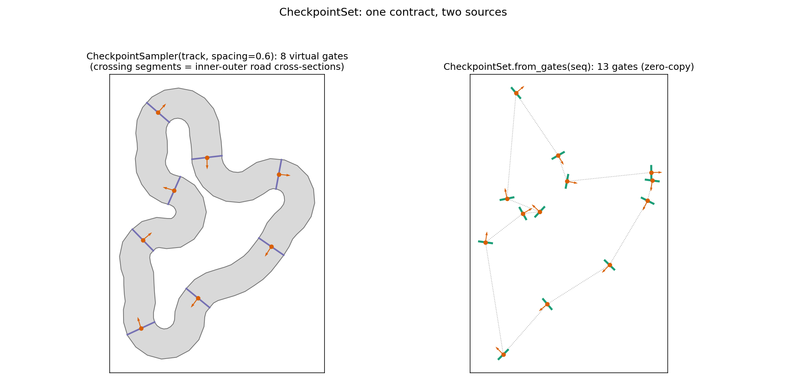
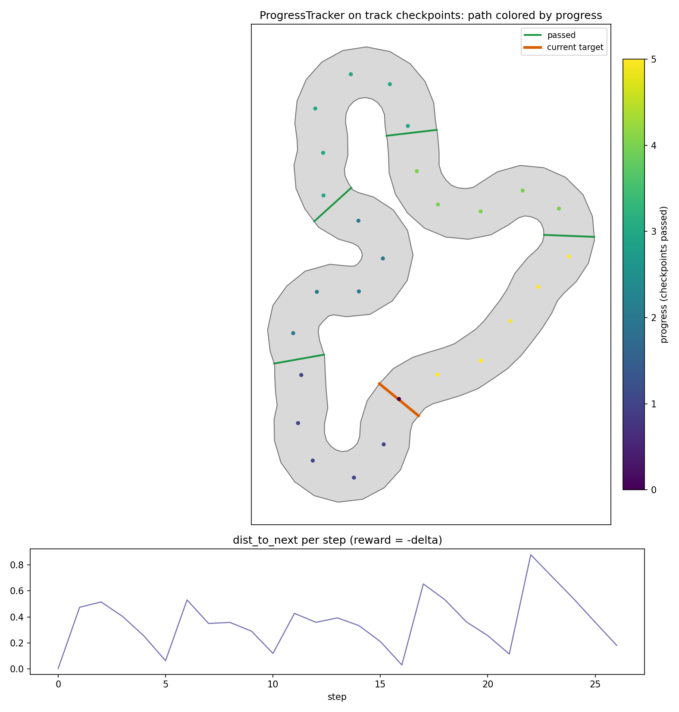

Runtime utilities: collision, props, checkpoints & progress
============================================================

Beyond generating tracks and gates, ``track_gen`` ships a family of
GPU-batched runtime utilities for the sim loop. They share the library's
conventions: flat NaN-padded batches, preallocated results overwritten in
place (``clone()`` for snapshots), CUDA-graph-capturable hot paths, and
results that are undefined for invalid envs (always gate on ``valid``).

.. figure:: ../assets/utilities-overview.png
   :alt: Overview of collision and props utilities.

   Out-of-bounds collision (segments + SDF backends) and boundary prop
   instancing on one generated track.

Out-of-bounds collision
-----------------------

``track_gen.collision.CollisionChecker`` answers, per oriented box, whether
it left the drivable band — with signed clearance, nearest boundary point,
and inward normal. Two backends: the exact ``segments`` scan (default; no
precompute, reads regenerated tracks automatically) and baked ``sdf`` grids
(O(1) queries after a per-regeneration ``bake()``; distances accurate to
about one grid cell). See the API reference for measured numbers; the rule
of thumb: ``segments`` unless a track batch serves hundreds of queries
between regenerations.

Boundary props (rendering-only instancing)
------------------------------------------

``track_gen.props.PropSampler`` resamples a boundary at a set spacing into
instancing poses — cones (``mode="points"``) or wall pieces
(``mode="segments"``, chord midpoint + yaw + length). Spacing snaps per env
so every ring closes without a seam. Props are not colliders; to make point
props physical, feed their positions to ``DiscChecker`` (below).

Checkpoints: one contract, two sources
--------------------------------------

``track_gen.checkpoints.CheckpointSet`` is an ordered list of course goals
per env — center ``position``, a physical crossing segment ``left <->
right``, and a forward ``tangent``:

.. code-block:: python

   from track_gen.checkpoints import CheckpointSampler, CheckpointSet

   cps = CheckpointSet.from_gates(gate_seq)          # zero-copy gate view
   cps = CheckpointSampler(track, spacing=0.6).sample()   # virtual gates

``from_gates`` aliases the ``GateSequence`` buffers (regenerated gates are
seen automatically). ``CheckpointSampler`` subsamples the CENTERLINE at a
coarse spacing; because track polylines are index-aligned, each checkpoint's
crossing segment is the road cross-section between ``inner`` and ``outer``.

   The same ``CheckpointSet`` contract from a subsampled track (left) and a
   gate sequence (right).

Progress tracking & rewards
---------------------------

``track_gen.progress.ProgressTracker`` consumes any ``CheckpointSet`` and
maintains per-env device state: previous position, next target, laps, total
progress. Each ``update()`` detects forward pass-through of the target's
crossing segment (swept-segment test), wrong-way and wrong-checkpoint
crossings, and reports ``dist_to_next`` — the distance to the next goal:

.. code-block:: python

   from track_gen.progress import ProgressTracker

   tracker = ProgressTracker(cps, position=robot_pos)  # latch onto sim buffer
   prev_d = None
   for _ in range(steps):
       sim.step()                       # writes robot_pos in place
       ev = tracker.update()            # no args: bound mode
       d = wp.to_torch(ev.dist_to_next)
       reward = (prev_d - d) if prev_d is not None else 0.0   # -delta distance
       reward = reward + 10.0 * wp.to_torch(ev.passed)        # pass bonus
       prev_d = d.clone()
   tracker.reset(done_mask)             # episodic resets, per env
   # `prev_d` above still holds the FINISHED episode's distance for envs
   # reset this step; mask it (e.g. zero the reward) before differencing.

``reset(mask)`` arms a NaN previous-position sentinel, so the first step
after a reset (or a teleport respawn) can never emit a spurious crossing.
After regenerating the course (gates or track), call ``reset`` for all envs.
That sentinel protects the TRACKER's own crossing/wrong-way detection only —
the caller-side ``-delta distance`` reward term needs its own masking, since
``prev_d`` for a just-reset env is stale (from the episode that just ended)
and differencing it against the freshly reset ``dist_to_next`` is not a
meaningful reward.

   A scripted agent threading track checkpoints. The lower panel shows the
   ``dist_to_next`` sawtooth your negative-delta reward differentiates.

Gate posts & point obstacles
----------------------------

``track_gen.collision.DiscChecker`` checks oriented boxes against disc
obstacles. Gate posts are two lines of code:

.. code-block:: python

   import numpy as np, warp as wp
   from track_gen.collision import DiscChecker

   dev = seq.left.device                       # bind posts on the same device
   posts = np.empty((E, 2 * G, 2), np.float32)
   posts[:, 0::2] = seq.left.numpy().reshape(E, G, 2)
   posts[:, 1::2] = seq.right.numpy().reshape(E, G, 2)
   checker = DiscChecker(wp.array(posts.reshape(-1, 2), dtype=wp.vec2f,
                                  device=dev),
                         radius=0.03, max_boxes=1, num_envs=E)

NaN padding in the gate arrays carries over and NaN discs are skipped, so no
per-env count bookkeeping is needed. A hit reports the deepest disc; for
interleaved posts, ``gate = disc // 2``.

``posts`` is a host-side snapshot taken via ``.numpy()`` — it does NOT alias
``seq.left``/``seq.right``, so a later regeneration is invisible to it;
rebuild ``posts`` (repeat this recipe) after every ``generate()``. The
``Course`` facade's built-in ``post_radius`` option does this rebuild
device-side, automatically, on every ``generate()``.

.. figure:: ../assets/disc-collision.png
   :alt: Gate posts as discs with boxes colored by hit.

   Gate posts as disc obstacles; the same checker makes cones physical.

Stable buffers and CUDA graphs
------------------------------

All utilities preallocate their state and results once (stable pointers) and
never allocate in the hot path. Per-step inputs can be BOUND once instead of
passed per call — ``ProgressTracker(cps, position=buf)``,
``DiscChecker(..., position=..., yaw=..., half_extents=...)``, and
``CollisionChecker.bind_inputs(...)`` — after which ``update()``/``query()``
take no arguments and read the buffers in place. Under graph capture this is
the intended pattern: the sim writes its stable pose buffers, then replays
the captured update. (Per-call mode also works under capture, but the SAME
arrays must be passed at capture and every replay.)

Outside capture, every utility follows a per-call ``wp.synchronize()`` after
its kernel launch (blocking, but simple — the codebase idiom). To record
``query()``/``update()``/``sample()`` into YOUR OWN CUDA graph — instead of
relying on the ``Course`` facade's built-in capture, below — call
``track_gen.set_capturing(True)`` before opening the capture region so those
per-call syncs are skipped, then restore it (``set_capturing(False)``, or
the value you saved beforehand) once the capture region is closed.

What needs refreshing after regenerating (when wiring the tools by hand,
i.e. not through ``Course``, which handles all of this for you):

.. list-table::
   :header-rows: 1
   :widths: 30 70

   * - Tool
     - After a regeneration
   * - ``CollisionChecker`` (``method="segments"``)
     - Nothing — reads the current ``Track`` buffers directly.
   * - ``CollisionChecker`` (``method="sdf"``)
     - Call ``bake()``.
   * - ``PropSampler`` / ``CheckpointSampler``
     - Call ``sample()``.
   * - ``ProgressTracker``
     - Call ``reset(mask)`` for ALL envs (a full progress reset).
   * - ``CheckpointSet.from_gates``
     - Nothing — aliases the ``GateSequence`` buffers automatically.
   * - ``Course``
     - Nothing — ``generate()`` performs the whole refresh above for you.

Putting it together: the Course facade
--------------------------------------

Everything above can be wired by hand — or bundled by
``track_gen.course.Course``, which owns the orchestration invariants
(rebake/resample/posts rebuild and a full progress reset on every
regeneration; per-env respawns via a mask):

.. code-block:: python

   from track_gen import TrackGenConfig
   from track_gen.course import Course, CourseConfig

   course = Course(CourseConfig(
       mode="track",
       gen=TrackGenConfig(num_envs=E, device="cuda"),
       seeds=42,
       collision="segments",          # or "sdf" / None
       checkpoint_spacing=0.6,
   ))
   course.bind(position=robot_pos, yaw=robot_yaw, half_extents=robot_he)

   track = course.generate()          # whole batch + coherent refresh
   for _ in range(steps):
       sim.step()                     # writes the bound buffers in place
       res = course.step()            # events + contacts, no args
       course.reset(done_mask)        # respawn finished envs on the same course
   course.generate(seeds=next_seed)   # new courses for everyone

``generate()`` is whole-batch (the generator pipelines are fixed-batch
captured graphs); per-env control is ``reset(mask)``. The generators are
deterministic under an unchanged RNG: calling ``generate()`` again WITHOUT
``seeds=`` reproduces the identical batch (plus a full progress reset), while
passing ``seeds=`` advances the RNG for new courses. In gates mode the same
object wraps ``GateGenerator`` + gate progress + optional ``DiscChecker``
posts (``post_radius > 0``). The underlying tools stay reachable
(``course.collision``, ``course.progress``, ``course.checkpoints``) and
``track_gen.set_capturing(True)`` flips the ONE shared capture flag used by
collision, props, checkpoints, progress, and the facade itself, all at
once, when you capture ``step()`` into your own sim graph. Once ``step()``
is captured, keep writing into the SAME bound buffers — rebinding after
capture leaves the captured graph replaying against the old pointers
(silently divergent results), so rebind only before (re)capturing.

In gates mode with ``post_radius > 0``, ``course.step().contacts`` is a
:class:`~track_gen.collision.DiscContact` instead of a
:class:`~track_gen.collision.BoxContact` — same ``StepResult`` field, a
different contact type depending on the course's collision checker:

.. code-block:: python

   res = course.step()
   hit = wp.to_torch(res.contacts.hit)      # DiscContact here, not BoxContact
