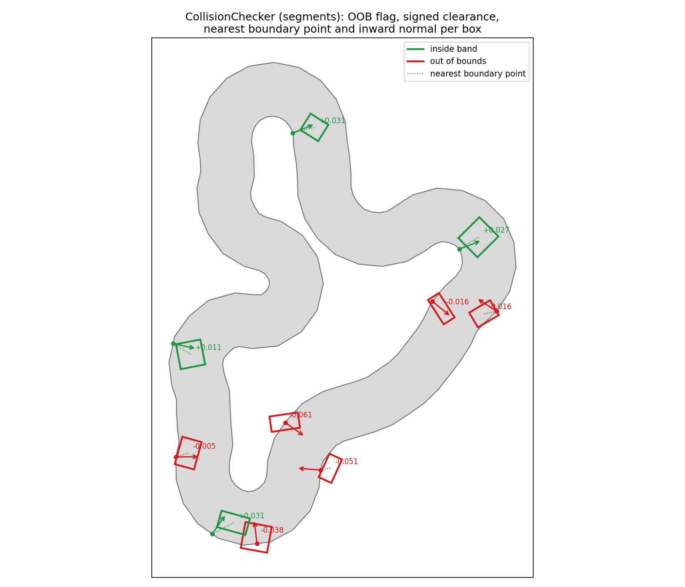
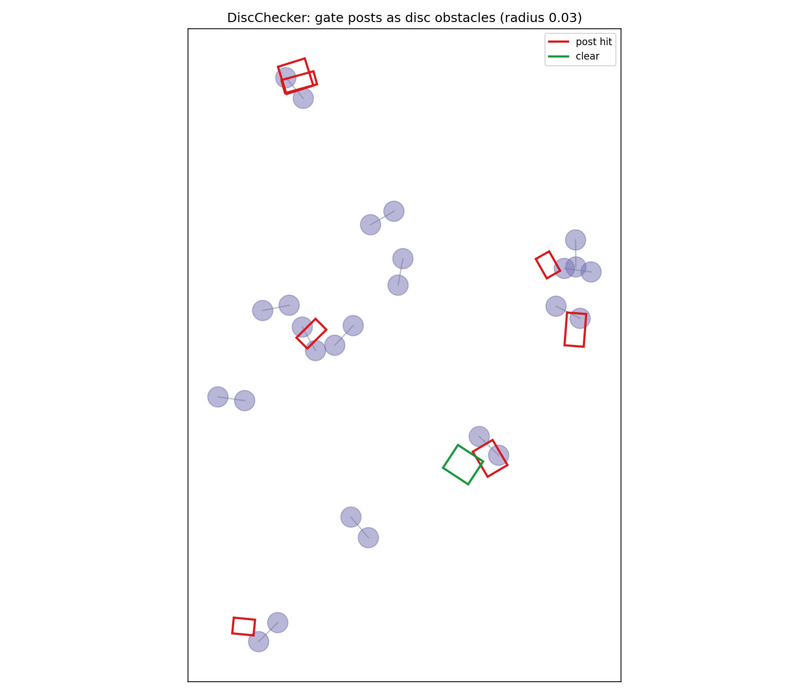

Out-of-bounds & obstacle collision
==================================

``track_gen.collision`` answers two questions every batched sim asks: *did
the agent leave the drivable band?* and *did it hit a point obstacle?*

Out-of-bounds checking
----------------------

``track_gen.collision.CollisionChecker`` answers, per oriented box, whether
it left the drivable band — with signed clearance, nearest boundary point,
and inward normal. Two backends: the exact ``segments`` scan (default; no
precompute, reads regenerated tracks automatically) and baked ``sdf`` grids
(O(1) queries after a per-regeneration ``bake()``; distances accurate to
about one grid cell). See Performance below for measured numbers; the rule
of thumb: ``segments`` unless a track batch serves hundreds of queries
between regenerations.

         bounds, each with its signed clearance, nearest boundary point,
         and inward normal drawn.

   The full per-box contact report: OOB flag (color), signed clearance
   (label), nearest boundary point (dotted) and inward normal (arrow).

Performance
-----------

Measured with ``benchmarks/benchmark_collision.py`` on an RTX 4090
(warp-lang 1.14, E = 8192 generated tracks × 8 boxes = 65,536 box queries
per call, default ``TrackGenConfig``):

.. list-table::
   :header-rows: 1
   :widths: 22 20 20 38

   * - backend
     - eager / query
     - graph replay / query
     - precompute per regeneration
   * - ``segments`` (exact)
     - ~0.32 ms
     - ~0.29 ms
     - none
   * - ``sdf`` (128² grids)
     - ~0.053 ms
     - ~0.025 ms
     - ~49 ms ``bake()`` + ~670 MB

Accuracy of ``sdf`` against the exact backend on the same workload: the
signed-distance error is typically ~2% of a grid cell (p99 < 0.4 cells);
OOB flags agree on 99.6% of boxes, disagreeing only inside the ±1-cell band
around zero clearance. SDF normals are noisy near the middle of the band
(medial axis) and at sharp features — prefer ``segments`` when normals or
nearest points drive a contact response.

Rule of thumb: ``segments`` is the default — exact, no memory, no rebake,
and already ~5 ns per box. Switch to ``sdf`` when a track batch serves more
than roughly 200 queries between regenerations and only the OOB flag and
approximate clearance are consumed (e.g. RL reward shaping).

Reproduce::

   python -m benchmarks.benchmark_collision --E 8192

Disc obstacles (gate posts, cones)
----------------------------------

``track_gen.collision.DiscChecker`` checks oriented boxes against disc
obstacles. Gate posts are two lines of code:

.. code-block:: python

   import numpy as np, warp as wp
   from track_gen.collision import DiscChecker

   dev = seq.left.device                       # bind posts on the same device
   posts = np.empty((E, 2 * G, 3), np.float32)
   posts[:, 0::2] = seq.left.numpy().reshape(E, G, 3)
   posts[:, 1::2] = seq.right.numpy().reshape(E, G, 3)
   checker = DiscChecker(wp.array(posts.reshape(-1, 3), dtype=wp.vec3f,
                                  device=dev),
                         radius=0.03, max_boxes=1, num_envs=E)

NaN padding in the gate arrays carries over and NaN discs are skipped, so no
per-env count bookkeeping is needed. A hit reports the deepest disc; for
interleaved posts, ``gate = disc // 2``.

``posts`` is a host-side snapshot taken via ``.numpy()`` — it does NOT alias
``seq.left``/``seq.right``, so a later regeneration is invisible to it;
rebuild ``posts`` (repeat this recipe) after every ``generate()``. The
``Course`` facade's built-in ``post_radius`` option does this rebuild
device-side, automatically, on every ``generate()``.

   Gate posts as discs; the same checker makes cones physical.

API: :class:`track_gen.collision.CollisionChecker`,
:class:`track_gen.collision.DiscChecker` — see the
:doc:`API reference </reference/api>`.
